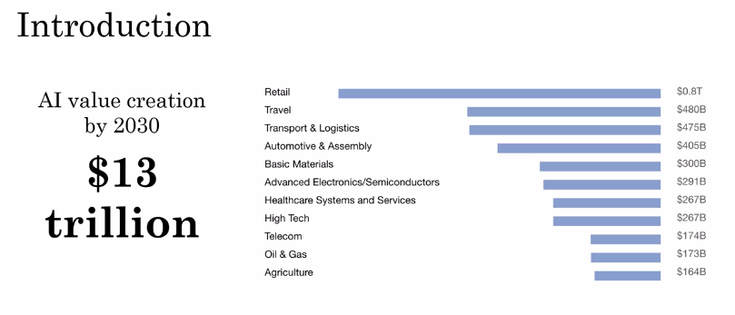
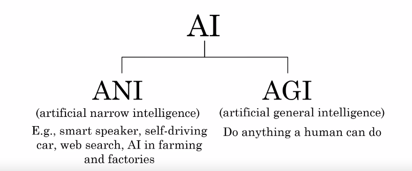
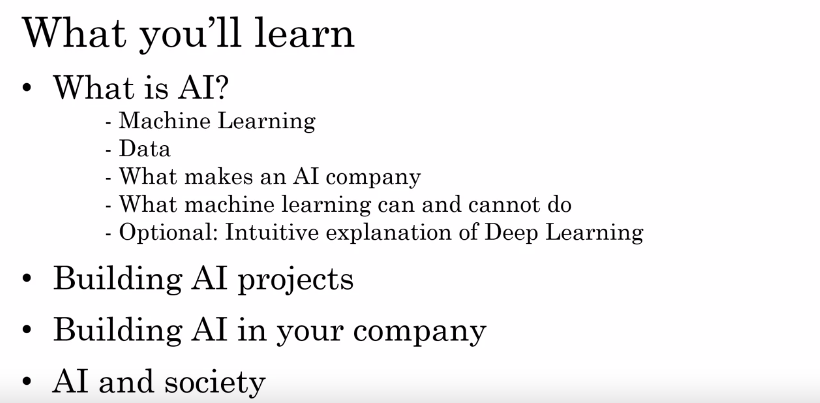

AI For Everyone
===============

by deeplearning.ai

# Module 1

#
## Title: What is AI?

## What is AI?

### Week 1 Introduction

* What you will learn in this course?
	1. AI is changing the way we work and live and this nontechnical course will teach you how to navigate the rise of AI
	1. Whether you want to know what's behind the buzzwords or whether you want to perhaps use AI yourself either in a personal context or in a corporation or other organization
	1. If you want to understand how AI is affecting society, and how you can navigate that
	1. In this first week, we'll start by cutting through the hype and giving you a realistic view of what AI really is
* According to a study by McKinsey Global Institute, AI is estimated to create an additional 13 trillion US dollars of value annually by the year 2030
* Even though AI is already creating tremendous amounts of value into software industry, a lot of the value to be created in a future lies outside the software industry
	* In sectors such as retail, travel, transportation, automotive, materials, manufacturing and so on
				

				  
				

* Types of AI
	1. Almost all the progress we are seeing in the AI today is __artificial narrow intelligence__ or __ANI__
		* These are AIs that do one thing such as a smart speaker or a self-driving car or AI to do web search or AI applications in farming or in a factory
		* These types of AI are one trick ponies but when you find the appropriate trick, this can be incredibly valuable
	1. Unfortunately, AI also refers to a second concept of __AGI__ or __artificial general intelligence__
		* That is the goal to build AI
		* They can do anything a human can do or maybe even be superintelligence and do even more things than any human can
				

				  
				

* There is alot of progress in __ANI__ or __artificial narrow intelligence__ and almost no progress to what __AGI__ or __artificial general intelligence__
* Both of these are worthy goals and unfortunately the rapid progress in __ANI__ which is incredibly valuable, that has caused people to conclude that there's a lot of progress in AI, which is true
	* But that has caused people to falsely think that there might be a lot of progress in __AGI__ as well which is leading to some irrational fears about evil clever robots coming over to take over humanity anytime now
* __WHAT YOU WILL LEARN IN THIS COURSE?__
				

				  
				

### Machine Learning

* The rise of AI has been largely driven by one tool in AI called __Machine Learning__