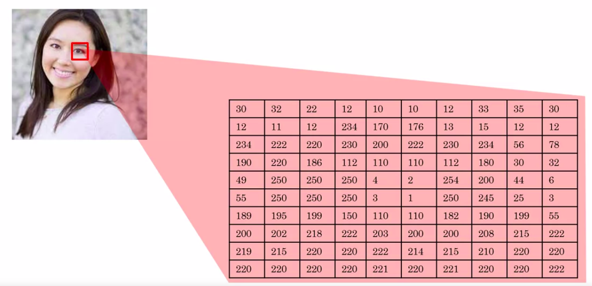

AI For Everyone
===============

by deeplearning.ai

# Module 1

#
## Title: What is AI?

## What is AI?

### Week 1 Introduction

* What you will learn in this course?
	1. AI is changing the way we work and live and this nontechnical course will teach you how to navigate the rise of AI
	1. Whether you want to know what's behind the buzzwords or whether you want to perhaps use AI yourself either in a personal context or in a corporation or other organization
	1. If you want to understand how AI is affecting society, and how you can navigate that
	1. In this first week, we'll start by cutting through the hype and giving you a realistic view of what AI really is
* According to a study by McKinsey Global Institute, AI is estimated to create an additional 13 trillion US dollars of value annually by the year 2030
* Even though AI is already creating tremendous amounts of value into software industry, a lot of the value to be created in a future lies outside the software industry
	* In sectors such as retail, travel, transportation, automotive, materials, manufacturing and so on
				

				  
				

* Types of AI
	1. Almost all the progress we are seeing in the AI today is __artificial narrow intelligence__ or __ANI__
		* These are AIs that do one thing such as a smart speaker or a self-driving car or AI to do web search or AI applications in farming or in a factory
		* These types of AI are one trick ponies but when you find the appropriate trick, this can be incredibly valuable
	1. Unfortunately, AI also refers to a second concept of __AGI__ or __artificial general intelligence__
		* That is the goal to build AI
		* They can do anything a human can do or maybe even be superintelligence and do even more things than any human can
				

				  
				

* There is alot of progress in __ANI__ or __artificial narrow intelligence__ and almost no progress to what __AGI__ or __artificial general intelligence__
* Both of these are worthy goals and unfortunately the rapid progress in __ANI__ which is incredibly valuable, that has caused people to conclude that there's a lot of progress in AI, which is true
	* But that has caused people to falsely think that there might be a lot of progress in __AGI__ as well which is leading to some irrational fears about evil clever robots coming over to take over humanity anytime now
* __WHAT YOU WILL LEARN IN THIS COURSE?__
				

				  
				

### Machine Learning

* The rise of AI has been largely driven by one tool in AI called __Machine Learning__
* The most commonly used type of machine learning is a type of AI that learns A to B, or input to output mappings. This is called __supervised learning__
				

				  
				

	* Example
		1. If the input A is an email and the output B one is email spam or not, i.e. zero or one
			* Then this is the core piece of AI used to build a __spam filter__
		1. if the input is an audio clip, and the AI's job is to output the text transcript, then this is __speech recognition__
		1. if you want to input English and have it output a different language, Chinese, Spanish, something else, then this is __machine translation__
		1. the most lucrative form of supervised learning, of this type of machine learning maybe be online advertising, where all the large online ad platforms have a piece of AI that inputs some information about an ad, and some information about you, and tries to figure out, will you click on this ad or not?
			* By showing you the ads you're most likely to click on
		1. if you want to build a self-driving car, one of the key pieces of AI is in the AI that takes as input an image, and some information from their radar, or from other sensors, and output the position of other cars, so your self-driving car can avoid the other cars
		1. In manufacturing, where you take as input a picture of something you've just manufactured, such as a picture of a cell phone coming off the assembly line
			* This is a picture of a phone, not a picture taken by a phone, and you want to output, is there a scratch, or is there a dent, or some other defects on this thing you've just manufactured? And this is visual inspection which is helping manufacturers to reduce or prevent defects in the things that they're making.
	* This set of AI called __supervised learning__
		* just learns input to output, or A to B mappings
		* On one hand, input to output, A to B it seems quite limiting. But when you find a right application scenario, this can be incredibly valuable
				

				  
				

* Why is supervised learning taking off now?
	* Let's say on the horizontal axis you plot the amount of data you have for a task
	* So, for speech recognition, this might be the amount of audio data and transcripts you have
		* In lot of industries, the amount of data you have access to has really grown over the last couple of decades. Thanks to the rise of the Internet, the rise of computers
	* Now, let's say on the vertical axis you plot the performance of an AI system
		* It turns out that if you use a traditional AI system, then the performance would grow like shown in image below, that as you feed in more data is performance gets a bit better
		* But beyond a certain point it did not get that much better
				

				  
				

		* So it's as if your speech recognition system did not get that much more accurate, or your online advertising system didn't get that much more accurate that's showing the most relevant ads, even as you show the more data
	* __AI__ has really taken off recently due to the rise of __neural networks__ and __deep learning__
		* But with modern AI, with neural networks and deep learning, what we saw was that, if you train a __small neural network__, then the performance looks like shown in image below, where as you feed them more data, performance keeps getting better for much longer
		* If you train a even __slightly larger neural network__, say medium-sized neural net, then the performance may look like shown in image below
		* If you train a very __large neural network__, then the performance just keeps on getting better and better
				

				  
				

	* For applications like speech recognition, online advertising, building self-driving car, where having a high-performance, highly accurate, say speech recognition system is important, enable these AI systems get much better, and make speech recognition products much more acceptable to users, much more valuable to companies and to users
	* If you want the best possible levels of performance, your performance to be up here (marked in image below), to hit this level of performance
				

				  
				

		* then you need two things
			1. One is, it really helps to have a lot of data. So that's why sometimes you hear about big data. Having more data almost always helps
			1. The second thing is, you want to be able to train a very large neural network
				* So, the rise of fast computers, including Moore's law, but also the rise of specialized processors such as graphics processing units or GPUs
					* has enabled many companies, not just a giant tech companies, but many many other companies to be able to train large neural nets on a large enough amount of data in order to get very good performance and drive business value
						

						  
						

> The most important idea in AI has been machine learning, has basically supervised learning, which means A to B, or input to output mappings

### What is data?

* Example
	1. Let's look at an example of a table of data which we also call a __dataset__
		* If you're trying to figure out how to price houses that you're trying to buy or sell, you might collect a dataset like
								

								  
								

			* this can be just a spreadsheet, like a MS excel spreadsheet of data where
				1. one column is the size of the house, say in square feet or square meters
				1. the second column is the price of the house
		1. So, if you're trying to build a AI system or Machine Learning system to help you set prices for houses or figure out if a house is priced appropriately
			* you might decide that the __size of the house is A__ and the __price of the house is B__, and have an AI system learn this input to output or A to B mapping
								

								  
								

		1. Now, rather than just pricing a house based on their size, you might say
			* Well, let's also collect data on the number of bedrooms of this house
				* In that case, A can be both of these first two columns, and B can be just the price of the house
								

								  
								

		* Data is often unique to your business, and this is an example of a dataset that a rural state agency might have that they tried to help price houses
	1. As another example, if you have a certain budget and you want to decide what is the size of house you can afford, then you might decide that
		* the input A is how much does someone spend
		* the input B is just the size of the house in square feet
		* that would be a totally different choice of A and B that tells you, given a certain budget, what's the size of the house you should be maybe looking at
								

								  
								

	1. Let's say that you want to build a AI system to recognize cats in pictures
		* So, you might collect a dataset where the input A is a set of different images and the output B are labels that says, "First picture is a cat, that's not a cat. That's a cat, that's not a cat" and have an AI input a picture A and output B is it the cats or not
								

								  
								

* How do you get data?
	1. One way to get data is manual labeling
		* For example, you might collect a set of pictures like these over here, and then you might either yourself or have someone else go through these pictures and label each of them
								

								  
								

		* By manually labeling each of these images, you now have a dataset for building a cat detector
		* manual labeling is a tried and true way of getting a dataset where you have both A and B
	1. Another way to get a dataset is from observing user behaviors or other types of behaviors
		* For example, let's say you run a website that sells things online
			* So, an e-commerce or an electronic commerce website where you offer things to users at different prices, and you can just observe if they buy your product or not
				* So, just through the act of either buying or not buying your product, you may be able to collected a data set like this, where you can store the user ID, the time the user visited your website, the price you offer the product to the users as well as whether or not they purchased it
								

								  
								

		* We can also observe behaviors of other things such as machines
			* If you run a large machine in a factory and you want to predict if a machine is about to fail or have a fault, then just by observing the behavior of a machine, you can then record a dataset like this
				* There's a machine ID, there's a temperature of the machine, there's a pressure within the machine, and then did the machine fail or not
		* If your application is prevent the maintenance, say you want to figure out if a machine is about to fail
			* then you could for example, choose 'machine', 'temperature', 'pressure' as the input A
			* choose 'machine fault' as the output B to try to figure out if a machine is about to fail in which case you might do preventative maintenance on the machine
									

									  
									

	1. The third and very common way of acquiring data is to download it from a website or to get it from a partner
		* Thanks to the open internet, there's just so many, there's as that you can download for free, ranging from computer vision or image datasets, to self-driving car datasets, to speech recognition datasets, to medical imaging data sets to many many more
		* So, if your application needs a type of data, you just download off the web keeping in mind licensing and copyright, then that could be a great way to get started on the application
* Use and Mis-use of Data
	* Data is important, but there's also little bit over-hyped and sometimes misused
	* Once you've started collecting some data, go ahead and start showing it or feeding it to an AI team
		* Because often, the AI team can give feedback to your IT team on what types of data to collect and what types of IT infrastructure to keep on building
		* For example
			* maybe an AI team can look at your factory data and say
				* "Hey. You know what? If you can collect data from this big manufacturing machine, not just once every ten minutes, but instead once every one minute, then we could do a much better job building a preventative maintenance systems for you."
			* So, there's often this interplay of this back and forth between IT and AI teams, and my advise is usually try to get feedback from AI earlier, because it can help you guide the development of your IT infrastructure
	* More data is usually better than less data, but I wouldn't take it for granted that just because you have many terabytes or gigabytes of data, that an AI team can actually make that valuable
		* So, my advice is don't throw data in a AI team and assume it will be valuable
									

									  
									

* Data is Messy
	* if you have bad data, then the AI will learn inaccurate things
		* Garbage in garbage out
	* Examples
		1. Let's say you have this data sets of size of houses, number of bedrooms, and the price
			* You can have incorrect labels or just incorrect data, like
				* This house is probably not going to sell for $0.1 just for one dollar. Or, data can also have missing values such as we have here a whole bunch of unknown values
									

									  
									

				* So, your AI team will need to figure out how to clean up the data or how to deal with these incorrect labels and all missing values
	* There are also multiple types of data, like images, audio, and text
		* These are types of data that humans find it very easy to interpret
		* This is called __unstructured data__
			* the techniques for dealing with unstructured data are little bit different than the techniques for dealing with structured data
		* There's a certain types of AI techniques that could work with images to recognize cats or audios to recognize speech or texts, or understand that email is spam
	* There are also datasets like the one on the right(check image below). This is an example of __structured data__
		* That basically means data that lives in a giant spreadsheet
									

									  
									

### The terminology of AI

* Let's say you have a housing dataset like this with the size of the house, number of bedrooms, number of bathrooms, whether the house is newly renovated as was the price
			

			  
			

* If you want to build a mobile app to help people price houses, so this would be the input A, and this would be the output B
			

			  
			

	* Then, this would be a machine-learning system, and particular would be one of those machine learning systems that learns inputs to outputs, or A to B mappings
	* So, machine learning often results in a running AI system
	* So, it's a piece of software that anytime of day, anytime of night you can automatically input A these properties of house and output B
	* So, if you have an AI system running, serving dozens or hundreds of thousands of millions of users, that's usually a machine-learning system
* In contrast, here's something else you might want to do, which is to have a team analyze your dataset in order to gain insights
	* So, a team might come up with a conclusion like,
		1. "Hey, did you know if you have two houses of a similar size, they've a similar square footage, if the house has three bedrooms, then they cost a lot more than the house of two bedrooms, even if the square for this is the same."
		1. "Did you know that newly renovated homes have a 15% premium, and this can help you make decisions such as, given a similar square footage, do you want to build a two bedroom or three bedroom size in order to maximize value?"
		1. "Is it worth an investment to renovate a home in the hope that the renovation increases the price you can sell a house for?"
	* So, these would be examples of data science projects, where the output of a data science project is a set of insights that can help you make business decisions, such as what type of house to build or whether to invest in renovation
* The boundaries between these two terms, machine learning and data science are actually little bit buzzy, and these terms are not used consistently even in industry today
* __Machine Learning__ is the field of study that gives computers the ability to learn without being explicitly programmed
	* This is a definition by Arthur Samuel many decades ago
		* __Arthur Samuel__ was one of the pioneers of machine learning, who was famous for building a checkers playing program
		* They could play checkers, even better than he himself, the inventor could play the game
	* So, a machine learning project will often results in a piece of software that runs, that outputs B given A
* __Data Science__ is the size of extracting knowledge and insights from data
	* So, the output of a data science project is often a slide deck, the PowerPoint presentation that summarizes conclusions for executives to take business actions or that summarizes conclusions for a product team to decide how to improve a website
			

			  
			

* Example ML vs Data Science : the online advertising industry
	* Today, to launch our platforms, all have a piece of AI that quickly tells them what's the ad you are most likely to click on. So, that's a __machine learning system__
		* This turns out to be incredibly lucrative AI system to inputs enrich about you and about the ad and outputs where you click on this or not
		* These systems are running 24-7. These are machine learning systems that drive our gravity for these companies, such as a piece of software that runs
	* If analyzing data tells you, for example, that the travel industry is not buying a lot of ads, but if you send more salespeople to sell ads to travel companies, you could convince them to use more advertising, then that would be an example of a __data science project__
		* the data science conclusion the results and the executives deciding to ask a sales team to spend more time reaching out to the travel industry
* __Deep Learning__
	* Let's say you want to predict housing prices, you want to price houses
		* So, you will have an input that tells you the size of the house, number of bedrooms, number of bathrooms and whether it's newly renovated
		* One of the most effective ways to price houses, given this input A would be to feed it to this thing here in order to have it output the price
			

			  
			

		* This big thing in the middle is called a __neural network__, and sometimes we also called an __artificial neural network__
		* That's to distinguish it from the neural network that is in your brain
			* So, the human brain is made up of neurons. So, when we say artificial neural network, that's just to emphasize that this is not the biological brain, but this is a piece of software
	* What a neural network does, or an artificial neural network does is takes this input A, which is all of these four things, and then output B, which is the estimated price of the house
			

			  
			

	* All of human cognition is made up of neurons in your brain passing electrical impulses, passing little messages each other
		* When we draw a picture of an artificial neural network, there's a very loose analogy to the brain
		* These little circles are called artificial neurons, or just neurons for short ( Shown in image above )
			* That also passes neurons to each other
		* This big artificial neural network is just a big mathematical equation that tells it given the inputs A, how do you compute the price B
	* The __key takeaways__ are that a neural network is a very effective technique for learning A to B or input-output mappings
* __AI has many tools__
			

			  
			

### What makes an AI company?

* A lesson we learned from the rise of the Internet was that, if you take your favorite shopping mall
			

			  
			

	* Internet Era
		* Internet company is a company that does the thing that internet let you do really well
			* For example
				* we engage and pervasive AB testing. Meaning we routinely threw up two different versions of website and see which one works better because we can. So, we learn much faster
				* Whereas in a traditional shopping mall, very difficult to have two shopping malls in two parallel universes and you can only maybe change things around every quarter or every six months
		* Internet company is since a very short iteration times
			* You can ship a new product every week or maybe even every day because you can whereas a shopping mall can be redesigned and we are protected only every several months
		* Internet companies also tend to push decision-making down from the CEO to the engineers and to other specialized rules such that the product managers
			* This is in contrast to a traditional shopping mall. We can maybe have the CEO just decide all the key decisions and then just everyone does what the CEO says
			* It turns out that traditional model doesn't work in the internet era because only the engineers and other specialized roles like product managers know enough about the technology and the product and the users to make great decisions
	* AI Era
		* You can take any company and have it use a few neural networks or few deep learning algorithms. That by itself does not turn the accompany into an AI company
		* what makes a great AI company, sometimes an AI first company is, are you doing the things that AI lets you do really well?
		* For example, AI companies are very good at strategic data acquisition
			* This is why many of the large consumer tech companies may have three products that do not monetize and it allows them to acquire data that they can monetize elsewhere
		* Serve less strategy teams where we would deliberately launch products that do not make any money just for the sake of data acquisition
		* Thinking through how to get data is a key part of the great AI companies
		* AI companies sends a unified data warehouses
			* If you have 50 different databases or 50 different data warehouses under the control of 50 different Vice-Presidents, then there will be impossible for an engineer to get the data into one place so that they can connect the dots and spot the patterns
			* So, many great AI companies have preemptively invested in bringing the data together into single data warehouse to increase the odds that the teams can connect the dots
			* Subject of course to privacy guarantees and also to data regulations such as GDPR in Europe
		* AI companies are very good at spotting automation opportunities
		* AI companies also have many new roles such as the MLE or Machine Learning Engineer and new ways of dividing up tasks among different members of a team
		* So, for a company to become good at AI means, architecting for company to do the things that AI makes it possible to do really well
* AI Transformation
	* This is the five-step AI transformation playbook that I (Andrew NG) recommend to companies that want to become effective at using AI
		1. Step one is to execute pilot projects to gain momentum
			* So, just to a few small projects to get a better sense of what AI can or cannot do and get a better sense of what doing an AI project feels like
			* This you could do in house or you can also do with an outsource team
		1. Step two which is the building in house AI team
			* provide broad AI training, not just to the engineers but also to the managers, division leaders and executives and how they think about AI
			* After doing this or as you're doing this, you have a better sense of what AI is and then is important for many companies to develop an AI strategy
		1. Finally, to align internal and external communications so that all your stakeholders from employees, customers and investors are aligns with how your company is navigating the rise of AI
			

			  
			

* AI has created tremendous value in the software industry and will continue to do so
	* It will also create tremendous value outside the software industry

### What machine learning can and cannot do

* In practice, before committing to a specific AI project, either you or engineers should do technical diligence on the project to make sure that it is feasible
	* This means: looking at the data, look at the input, and output A and B, and just thinking through if this is something AI can really do
* Unfortunately some CEOs can have an inflated expectation of AI and can ask engineers to do things that today's AI just cannot do
* One of the challenges is that the media, as well as the academic literature, tends to only report on positive results or success stories using AI, and we see a string of success stories and no failure stories, people sometimes think AI can do everything
	* Unfortunately, that's just not true
* Supervised Learning
	* List of AI applications from spam filtering to speech recognition, to machine translation, and so on
			

			  
			

	* One imperfect rule of thumb you can use to decide what supervised learning may or may not be able to do is that, pretty much anything you could do with a second of thought, we can probably now or soon automate using supervised learning, using this input-output mapping
	* So for example, in order to determine the position of other cars, that's something that you can do with less than a second
		* In order to tell if a phone is scratched, you can look at it and you can tell in less than a second
		* In order to understand or at least transcribe what was said, it doesn't take that many seconds of thought
	* While this is an imperfect rule of thumb, it maybe gives you a way to quickly think of some examples of tasks that AI systems can do
* Whereas in contrast, something that AI today cannot do would be
	* to analyze a market and write a 50 page report, a human cannot write a 50 page mark of analysis report in a second, and it's very difficult, at least I don't know
* Example
	1. Relating to Customer Support Automation
		* Let's see a random website that sells things, so an e-commerce company, and you have a customer support division that gets an email like this (check image below)
				

				  
				

			* If what you want is an AI system that looks at this and decides this is a refund request, so let me route it to my refund department, then I will say, you have a good chance of building an AI system to do that
			* The AI system would take as input, the customer text, what the customer emails you, and it would output, is this a refund requests or is this a shipping problem, or is it the other request, in order to route this email to the most appropriate parts of your customer support center
				* So, the __input A__ is the text and the __output B__ is one of these three outcomes, is it a refund or a shipping problem, or shipping query, or is it a different requests
		* Things AI cannot do
			* if you want the AI to input an email and automatically generate, it responds like, "Oh, sorry to hear that. I hope you're niece had a good birthday. Yes, we can help with, and so on."
			* So, for an AI to output a complicated piece of text like this today is very difficult by today's standards of AI and in fact to even empathize about the birthday of your niece, that is very difficult to do for every single possible type of email you might receive
				

				  
				

		* let's say you tried to get an AI system to input the user's email, and output a two to the three paragraph, empathetic and appropriate response
			* Let's say that you have a modest-sized dataset like a 1,000 examples of user emails and appropriate responses
			* It turns out if you run an AI system on this type of data, on a small dataset like 1,000 examples, this may be the performance you get, which is if a user emails (Shown in image below)
				

				  
				

			* But the problem with building this type of AI is that with just a 1,000 examples, there's just not enough data for an AI system to learn how to write to the three paragraph, appropriate and empathetic responses
			* So, you may end up just generating the same very simple response like, "Thank you for your email," no matter what the customer is sending you
			* Another thing that could go wrong, another way for an AI system to fail is if it generates gibberish such as: "When is my box arriving," and it says, "Thank, yes, now your," gibberish
				* This is a hard enough problem that even with 10,000 or a 100,000 email examples, I don't know if that would be enough data for an AI system to do this well
*  The rules for what AI can and cannot do are not hardened first and I usually end up having to ask engineering teams to sometimes spend a few weeks doing deep technical diligence to decide for myself if a project is feasible
* What makes an Machine Learning problem easier?
	1. One, learning a simple concept is more likely to be feasible
		* Well, what does a simple concept mean? There's no formal definition of that but it is something that takes you less than a second of mental thought or a very small number of seconds of mental thought to come up with a conclusion then that would lean to whether it being a simple concept
		* So, you're looking outside the window of a self-driving car to spot the other cars that would be a relatively simple concept
		* Whereas how to write an empathetic response, so a complicated user complaints, that would be less of a simple concept
	1. Second, a machine learning problem is more likely to be feasible if you have lots of data available
		* Here, our data means both the input A and the output B, that you want the AI system to have in your A to B, input to output mapping
		* For Example
			* in the customer support application, the input A would be examples of emails from customers and B could be labeling each of these customer emails as to whether it's a refund requests or a shipping query, or some other problem, one of three outcomes
			* Then if you have thousands of emails with both A and B, then the odds of you building a machine learning system to do that would be pretty good
		

		  
		

### More examples of what machine learning can and cannot do

* One of the challenges of becoming good at recognizing what AI can and cannot do is that it does take seeing a few examples of concrete successes and failures of AI
	* If you work on an average of say, one new AI project a year, then to see three examples would take you three years of work experience and that's just a long time
* Examples
	1. Let's say you're building a self-driving car
		* Here's something that AI can do pretty well, which is to take a picture of what's in front of your car and maybe just using a camera, maybe using other senses as well such as radar or lidar
		* Then to figure out, what is the position, or where are the other cars
		* So, this would be an AI where the input A, is a picture of what's in front of your car, or maybe both a picture as well as radar and other sensor readings
		* The output B is, where are the other cars?
		* Today, the self-driving car industry has figured out how to collect enough data and has pretty good algorithms for doing this reasonably well
		* So, that's what the AI today can do
			

			  
			

	1. Here's an example of something that today's AI cannot do, or at least would be very difficult using today's AI
		* which is to input a picture and output the intention of whatever the human is trying to gesture at your car
				

				  
				

			* So, here's a construction worker holding out a hand to ask your car to stop (shown in image above)
			* Here's a hitchhiker trying to wave a car over (shown in image above)
			* Here is a bicyclist raising the left-hand to indicate that they want to turn left (shown in image above)
		* So, if you were to try to build a system to learn the A to B mapping, where the input A is a short video of our human gesturing at your car, and the output B is, what's the intention or what does this person want, that today is very difficult to do
		* Part of the problem is that the number of ways people gesture at you is very, very large
		* Imagine all the hand gestures someone could conceivably use asking you to slow down or go, or stop
		* So, it's difficult to collect enough data from enough thousands or tens of thousands of different people gesturing at you, and all of these different ways to capture the richness of human gestures
		* Then second, because this is a safety critical application, you would want an AI that is extremely accurate in terms of figuring out, does a construction worker want you to stop, or does he or she wants you to go? And that makes it harder for an AI system as well
		* In contrast, even if you collect pictures or videos of 10,000 people, it's quite hard to track down 10,000 people waving at your car
			* Even with that data set, I think it's quite hard today to build an AI system to recognize humans intentions from their gestures at the very high level of accuracy needed in order to drive safely around these people
		* So, that's why today, many self-driving car teams have some components for detecting other cars, and they do rely on that technology to drive safely
		* But very few self-driving car teams are trying to count on the AI system to recognize a huge diversity of human gestures and counting just on that to drive safely around people
	1. Say you want to build an AI system to look at X-ray images and diagnose pneumonia
		* So, all of these are chest X-rays (Shown in image below)
				

				  
				

		* So, the input A could be the X-ray image and the output B can be the diagnosis --> Does this patient have pneumonia or not?
		* So, that's something that AI can do
		* AI CANNOT DO
			* Something that AI cannot do would be to diagnose pneumonia from 10 images of a medical textbook chapter explaining pneumonia
			* A human can look at a small set of images, maybe just a few dozen images, and reads a few paragraphs from medical textbook and start to get a sense
		* Whereas a young medical doctor might learn quite well reading a medical textbook at just looking at maybe dozens of images
			* In contrast, an AI system isn't really able to do that today
* Strengths and Weakness of Machine Learning
	* Machine learning tends to work well when you're trying to learn a simple concept, such as something that you could do with less than a second of mental thought, and when there's lots of data available
	* Machine learning tends to work poorly when you're trying to learn a complex concept from small amounts of data
	* A second underappreciated weakness of AI is that it tends to do poorly when it's asked to perform on new types of data that's different than the data it has seen in your data set
		* For Example
			* Say you built a supervised learning system that uses A to B to learn to diagnose pneumonia from images like these on left side of image (check image shown below : left side)
			* These are well pretty high quality chest X-ray images
				

				  
				

			* But now, let's say you take this AI system and apply it at a different hospital or different medical center, where maybe the X-ray technician somehow strangely had the patients always lie at an angle or sometimes there are these defects (check image shown below : left side)
				* These low other objects lying on top of the patients
			* If the AI system has learned from data like that on your left, maybe taken from a high-quality medical center, and you take this AI system and apply it to a different medical center that generates images like those on the right, then it's performance will be quite poor as well
			* A good AI team would be able to ameliorate, or to reduce some of these problems, but doing this is not that easy
			* This is one of the things that AI is actually much weaker than humans
				* If a human has learned from images on the left, they're much more likely to be able to adapt to images like those on the right as they figure out that the patient is just lying on an angle
				* But then AI system can be much less robust than human doctors in generalizing or figuring out what to do with new types of data like these

### Non-technical explanation of deep learning (Part 1, optional)

* The terms deep learning and neural network are used almost interchangeably in AI
* And even though they're great for machine learning, there's also been a bit of hype and bit of mystique about them
* Example
	1. Demand Prediction
		* Let's say you run a website that sells t-shirts
			* And you want to know, based on how you price the t-shirts, how many units you expect to sell, how many t-shirts you expect to sell
		* You might then create a dataset like this, where the higher the price of the t-shirt, the lower the demand (shown in image below)
		* So you might fit a straight line to this data, showing that as the price goes up, the demand goes down
		* Now demand can never go below zero, so maybe you say that the demand will flatten out at zero, and beyond a certain point you expect pretty much no one to buy any t-shirts
		* It turns out this blue line is maybe the simplest possible neural network (shown in image below)
		* You have as input the price, A, and you want it to output the estimated demand, B
		* So the way you would draw this as a neural network is that the price will be input to this little round thing there, and this little round thing outputs the estimated demand (shown in image below)
			* In the terminology of AI, this little round thing here is called a neuron, or sometimes it's called an __artificial neuron__, and all it does is compute this blue curve that is drawn here on the left
		* This is maybe the simplest possible neural network with a single artificial neuron, that just inputs the price and outputs the estimated demand
				

				  
				

		* If you think of this orange circle, this artificial neuron as a little Lego brick, all that a neural network is, if you take a lot of these Lego bricks and stack them on top of each other until you get a big power, a big network of these neurons
	1. More complex example
		* Suppose that instead of knowing only the price of the t-shirts, you also have the shipping costs that the customers will have to pay to get the t-shirts
		* May be you spend more or less on marketing in a given week, and you can also make the t-shirt out of a thick, heavy, expensive cotton or a much cheaper, more lightweight material
			* These are some of the factors that you think will affect the demand for your t-shirts
		* Let's see what a more complex neural network might look like
			* You know that your consumers care a lot about affordability
			* So let's say you have one neuron, and let me draw this one in blue, whose job it is to estimate the affordability of the t-shirts (shown in image below)
				* And so affordability is mainly a function of the price of the shirts and of the shipping cost
			* A second thing though affecting demand for your t-shirts is awareness --> How much are consumers aware that you're selling this t-shirt?
				* So the main thing that affects awareness, is going to be your marketing
				* So let me draw here a second artificial neuron that inputs your marketing budget, how much you spend on marketing, and outputs how aware are consumers of your t-shirt
			* Finally, the perceived quality of your product will also affect demand, and perceived quality would be affected by marketing
				* The marketing tries to convince people this is a high quality t-shirt, and sometimes the price of something also affects perceived quality
				* So I'm going to draw here a third artificial neuron that inputs price, marketing and material, and tries to estimate the perceived quality of your t-shirts
			* Finally, now that the earlier neurons, these three blue neurons, have figured out how affordable, how much consumer awareness and what's the perceived quality, you can then have one more neuron over here (shown in image below) that takes as input these three factors and outputs the estimated demand
				* So this is a neural network, and its job is to learn to map from these four inputs, that's the input A, to the output B, to demand
				* So it learns this input output or A to B mapping
			* This is a fairly small neural network with just four artificial neurons
			* In practice, neural networks used today are much larger, with easily thousands, tens of thousands or even much larger than that numbers of neurons
				

				  
				

* One final detail of this description that I want to clean up, which is that in the way I've described the neural network, it was as if you had to figure out that the key factors are affordability, awareness and perceived quality
* One of the wonderful things about using neural networks is that to train a neural network
	* In other words, to build a machine learning system using neural network, all you have to do is give it the input A and the output B
	* And it figures out all of the things in the middle by itself
* So to build a neural network, what you would do is feed it lots of data, or the input A, and have a neural network that just looks like this, with a few blue neurons feeding to a yellow open neuron ( shown in image below )
	* And then you have to give it data with the demand B as well
	* And it's the software's job to figure out what these blue neurons should be computing, so that it can completely automatically learn the most accurate possible function mapping from the input A to the output B
	* And it turns out that if you give this enough data and train a neural network that is big enough, this can do an incredible good job mapping from inputs A to outputs B
				

				  
				

> __Neural Network__, is a group of artificial neurons each of which computes a relatively simple function. But when you stack enough of them together like Lego bricks, they can compute incredibly complicated functions that give you very accurate mappings from the input A to the output B

### Non-technical explanation of deep learning (Part 2, optional)

* Say you want to build a system to recognize people from pictures
	* how can a piece of software look at this picture and figure out the identity of the person in it?
	* Let's zoom in to a little square like that to better understand how a computer sees pictures
		* Where you and I see a human eye, a computer instead sees that, and sees this grid of pixel brightness values that tells it, for each of the pixels in the image, how bright is that pixel
				

				  
				

		* If it were a black and white or grayscale image, then each pixel would correspond to a single number telling you how bright is that pixel
		* If it's a color image, then each pixel will actually have three numbers, corresponding to how bright are the red, green, and blue elements of that pixel
	* So, the neural networks job is to take as input a lot of numbers like these and tell you the name of the person in the picture
	* In this example, the neural network just has to input a lot more numbers corresponding to all of the pixel brightness values of this picture
		* If the resolution of this picture is 1000 pixels by 1000 pixels, then that's a million pixels
		* So, if it were a black and white or grayscale image, this neural network was take as input a million numbers corresponding to the brightness of all one million pixels in this image
			* if was a color image it would take as input three million numbers corresponding to the red, green, and blue values of each of these one million pixels in this image
	* Similar to before, you will have many many of these artificial neurons computing various values, and it's not your job to figure out what these neurons should compute (shown in image below)
		* The neural network will figured out by itself
	* Typically, when you give it an image, the neurons in the earlier parts of the neural network will learn to detect edges in pictures and then lobe and later learn to detect parts of objects
	* So, they learn to detect eyes and noses and the shape of cheeks and the shape of mouths
		* and then the later neurons, further to the right (shown in image below), will learn to detect different shapes of faces and it will finally, put all this together to output the identity of the person in the image
	* Again, part of the magic of neural networks is that you don't really need to worry about what it is doing in the middle
	* All you need to do is give it a lot of data of pictures like this, A, as well as the correct identity B and the learning algorithm will figure out by itself what each of these neurons in the middle should be computing
				

				  
				

