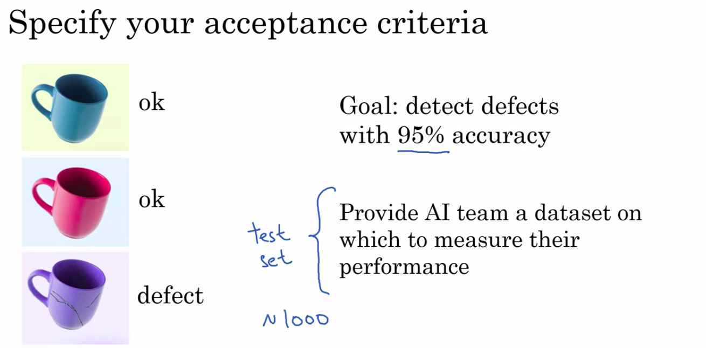

AI For Everyone
===============

by deeplearning.ai

# Module 2

#
## Title: Building AI Projects

## Building AI Projects

### Week 2 Introduction

* Overview of Week 2
	

	  
	

### Workflow of a machine learning project

* Machine learning algorithms can learn input to output or A to B mappings
* Example
	1. Speech Recognition
		* So, some of you may have an Amazon Echo or Google Home or Apple Siri device or a Baidu DuerOS device in your homes
		* So, how do you build a speech recognition system that can recognize when you say, "Alexa," or "Hey, Google," or "Hey, Siri," or "Hello, Baidu"?
				

				  
				

		* Let's go through the key steps of a machine learning project
			* If you want to build an AI system or build a machine learning system to figure out when a user has said the word Alexa
				* the first step is to collect data
					* So, that means, you would go around and get some people to say the word "Alexa" for you and you record the audio of that
					* You'll also get a bunch of people to say other words like "Hello," or say lots of other words and record the audio of that as well
					* Having collected a lot of audio data, a lot of these audio clips of people saying either "Alexa" or saying other things
				* step two is to then train the model
					* This means you will use a machine learning algorithm to learn an input to output or A to B mapping, where the input A would be an audio clip
					* In the case of the first audio clip above, hopefully, it will tell you that the user said "Alexa," and in the case of audio clip two, shown on the right (shown in image below : right), hopefully, the system will learn to recognize that the user has said "Hello."
					* Whenever an AI team starts to train the model, meaning to learn the A to B or input-output mapping, what happens, pretty much every time, is the first attempt doesn't work well
						* So invariably, the team will need to try many times or in AI, we call this iterate many times
						* You have to iterate many times until, hopefully, the model looks like is good enough
				* third step is to then actually deploy the model
					* What that means is you put this AI software into an actual smart speaker and ship it to either a small group of test users or to a large group of users
					* What happens in a lot of AI products is that when you ship it, you see that it starts getting new data and it may not work as well as you had initially hoped
					* for example, I am from the UK. So, I'm going to pick on the British
						* But let's say you had trained your speech recognition system on American-accented speakers and you then ship this smart speaker to the UK and you start having British-accented people say "Alexa."
						* They may find that it doesn't recognize the speech as well as you had hoped
						* When that happens, hopefully, you can get data back of cases such as maybe British-accented speakers was not working as well as you're hoping, and then use this data to maintain and to update the model
							

							  
							

* The key steps of a machine learning project are
	1. to collect data
	1. to train the model, the A to B mapping
	1. to deploy the model
* Throughout these steps, there is often a lot of iteration, meaning fine-tuning or adapting the model to work better or getting data back even after you've shipped it to, hopefully, make the product better
	* which may or may not be possible depending on whether you're able to get data back
* Let's look at these three steps and see how they apply on a different project on building a key component of a self-driving car
	* Let's say you're building a self-driving car
		* One of the key components of a self-driving car is a machine learning algorithm that takes as input, say a picture, of what's in front of your car and tells you where are the other cars
		* So, what's the first step of building this machine learning system?
			* The first step is to collect data
				* So, if your goal is to have a machine learning algorithm that can take as input an image and output the position of other cars, the data you would need to collect would be both images as well as position of other cars that you want the AI system to output
				* So, let's say you start off with a few pictures like this (shown in image below)
					* These are the inputs A to the machine learning algorithm
				* You need to also tell it what is the output B you would want. So, for each of these pictures, you would draw a rectangle around the cars in the picture that you wanted to detect
				* NOTE: On this slide, I'm hand drawing these rectangles, but in practice, you will use some software that lets you draw perfect rectangles rather than these hand-drawn ones
			* the second step is to train the model
				* when your AI engineers start training a model, they'll find, initially, that it doesn't work that well. For example, given this picture, maybe the software, the first few tries, thinks that that is a car
				* It's only by iterating many times that you, hopefully, get a better result when figuring out that that is where the car actually is
			* the third step is to deploy the model.
				* Of course, in the self-driving world, it's important to treat safety as number one, and deploy model or to test the model only in ways that can preserve safety
				* But when you put the software in cars on the road, you may find that there are new types of vehicles, say golf carts, that the software isn't detecting very well
				* So, you get data back, say, pictures of these golf carts, using new data to maintain and update the model so that, hopefully, you can have your AI software continually get better and better to the point where you end up with a software that can do a pretty good job detecting other cars from pictures like these
							

							  
							

### Workflow of a data science project

* Unlike a machine learning project, the output of a data science project is often a set of actionable insights, a set of insights that may cause you to do things differently
* So, data science projects have a different workflow than machine learning projects
* Example
	1. let's say you want to optimize a sales funnel
		* Say you run a e-commerce or a online shopping website that sells coffee mugs and so for a user to buy a coffee mug from you, there's a sequence of steps they'll usually follow
			* First, they'll visit your website and take a look at the different coffee mugs on offer
			* then eventually, they have to get to a product page
			* then they'll have to put it into their shopping cart, and go to the shopping cart page
			* then they'll finally have to check out
							

							  
							

		* So, if you want to optimize the sales funnel to make sure that as many people as possible get through all of these steps, how can you use data science to help with this problem?
			* Let's look at the key steps of a data science project
				1. The first step is to collect data
					* So, on a website like the one we saw, you may have a data set that stores when different users go to different web pages
					* In this simple example, I'm assuming that you can figure out the country that the users are coming from
						* for example, by looking at their computers' address, called an IP address, and figuring out what is the country from which they're originating
					* But in practice, you can usually get quite a bit more data about users than just what country they're from
				1. The second step is to then analyze the data
					* data science team may have a lot of ideas about what is affecting the performance of your sales funnel
					* For example, they may think that overseas customers are scared off by the international shipping costs which is why a lot of people go to the checkout page but don't actually check out
						* If that's true then you might think about whether to put part of shipping costs into the actual product costs
					* Your data science team may think there are blips in the data whenever there's a holiday
						* Maybe more people will shop around the holidays because they're buying gifts or maybe fewer people will shop around the holidays because they're staying home rather than sometimes shopping from their work computers
					* In some countries, there may be time-of-day blips where in countries that observe a siesta, so a time of rest like an afternoon rest, there may be fewer shoppers online and so your sales may go down
						* They may then suggest that you should spend fewer advertising dollars during the period of siesta because fewer people will go online to buy at that time
				1. Finally, the data science team will distill these insights down to a smaller number of hypotheses about ideas of what could be going well and what could be going poorly
						* as well as a smaller number of suggested actions such as incorporating shipping costs into the product costs rather than having it as a separate line item
					* When you take some of these suggested actions and deploy these changes to your website, you then start to get new data back as users behave differently now that you advertise differently at the time of siesta or have a different check out policy
					* Then your data science team can continue to collect data and we analyze the new data periodically to see if they can come up with even better hypotheses or even better actions over time
							

							  
							

* The key steps of a data science project are
	1. to collect the data
	1. to analyze the data
	1. to suggest hypotheses and actions
		1. then to continue to get the data back and reanalyze the data periodically
* Example : to optimizing a manufacturing line
	* Let's say you run a factory that's manufacturing thousands of coffee mugs a month for sale and you want to optimize the manufacturing line
	* So, these are the key steps in manufacturing coffee mugs
		1. Step one is to mix the clay, so make sure the appropriate amount of water is added
		1. Step two is take this clay and to shape the mugs
		1. Then you have to add the glaze, so add the coloring, a protective cover
		1. Then you have to heat this mug and we call that firing the kiln
		1. Finally, you would inspect the mug to make sure there aren't dents in the mug and it isn't cracked before you ship it to customers
							

							  
							

	* So, a common problem in manufacturing is to optimize the yield of this manufacturing line to make sure that as few damaged coffee mugs get produced as possible because those are coffee mugs you have to throw away, resulting in time and material waste
		1. the first step is to collect data
			* So for example, you may save data about the different batches of clay that you've mixed, such as who supplied the clay and how long did you mix it, or maybe how much moisture was in the clay, how much water did you add
			* You might also collect data about the different batches of mugs you made
				* So how much humidity was in that batch? What was the temperature in the kiln and how long did you fire it in the kiln?
		1. the second step is to analyze data
			* Given all this data you would then ask the data science team to analyze the data and they would, as before, iterate many times to get good insights
			* So, they may find that, for example, that whenever the humidity is too low and the kiln temperature is too hot that there are cracks in the mug or they may find out that because it's warmer in the afternoon that you need to adjust the humidity and temperature depending on the time of day
		1. the third step is to suggest hypothesis and actions
			* Based on the insights from your data science team you get suggestions for hypotheses and actions on how to change the operations and manufacturing line in order to improve the productivity of the line
			* When you deploy the changes, you then get new data back that you can reanalyze periodically so they can keep on optimizing the performance of your manufacturing line
							

							  
							

> The __key steps of a data science project__ are to __collect the data__, to __analyze the data__, and then to __suggest hypotheses and actions__

### Every job function needs to learn how to use data

* Data is transforming many different job functions, whether you work in recruiting or sales or marketing or manufacturing or agriculture, data is probably transforming your job function
* What's happened in the last few decades is the digitization of our society
	* So, rather than handing out papers surveys, surveys are more likely to be done in digital format or doctors still write some handwritten notes but doctors handwritten note is increasingly likely to be a digital record and so to this in just about every single job function
	* This availability of data means that there's a good chance that your job function could be helped with tools like data science or machine learning
1. __Sales__
	* We have already seen how data science can be used to optimize a sales funnel
	* How machine learning can be used for Automated Lead Sorting
		* If you're a salesperson you may have a set of leads about different people that you could reach out to to convince them to buy something from your company
		* Machine learning can help you prioritize these leads
			* So, you might want to prioritize calling up the CEO of a large company rather than the intern at a much smaller company
			* this type of automated leads sorting is making salespeople more efficient
							

							  
							

1. __Manufacturing Line Manager__
	* We have already seen how data science can be used to Optimize a Manufacturing Line
	* How machine learning can be used for Automated Visual Inspection
		* One of the steps of this manufacturing process is the final inspection
		* In fact today, in many factories there can be hundreds or thousands of people using the human eye to check over objects, maybe coffee mugs, maybe other things to see if they're scratches or dents and that's called inspection
		* So, machine learning can take this input, a dataset like (as shown in image below) this, and learn to automatically figure out if a coffee mug is defective or not
		* By automatically finding scratches or dents, it can reduce labor costs and also improve quality in your factory
		* This type of automated visual inspection is one of the technologies that I think will have a big impact on manufacturing
							

							  
							

1. __Recruiting__
	* When recruiting someone to join your company, there may be a pretty predictable sequence of steps where
		1. your recruiter or someone else would send an email to a candidate
		1. then you'd have a phone call with them
		1. bring them on-site for an interview
		1. then extend an offer and maybe close the offer
	* Similar to how data science can be used to optimize a sales funnel, recruiting can also use data science to optimize a recruiting funnel and in fact many recruiting organizations are doing so today
		* For example, if you find that hardly anyone is making it from phone screen step to the on-site interviews step then you may conclude that maybe too many people are getting into the phone screen stage or maybe the people doing the phone screen are just being too tough and you should let more people get to the onsite interview stage
		* This type of data science is already having an impact on recruiting
	* What about machine learning projects?
		* Well, one of the steps of recruiting is to screen a lot of resumes to decide who to reach out to you
		* So, you may have to look at one resume and say, "Yes, let's email them", look at a different one to say, "No, let us not move ahead with this candidate."
		* Machine learning is starting to make its way into automated resume screening
		* Does raise important ethical questions such as making sure that your AI software does not exhibit undesirable forms of bias and treats people fairly, but machine learning is starting to make inroads into this and I hope can do so while making sure that the systems are ethical and fair
							

							  
							

1. __Marketing__
	* One of the common ways to optimize the performance in website is called AB testing, in which you launch two versions of website
		* Here version A has a red button, version B has a green button and you measure which websites causes people to click through more ( as shown in image )
		* So with this type of data, a data science team can help you gain insights and suggests hypotheses or actions for optimizing your website
	* How about machine learning and marketing?
		* Today a lot of websites will give customized product recommendations to show you the things you're most likely to want to buy and this actually significantly increases sales on these websites
		* For example, a clothing website after seeing the way I shop after while, will hopefully just recommend blue shirts to me because that's frankly pretty much the only type shirt I ever buy, but maybe other customers will have more diverse and more interesting recommendations than mine
	* But today these customized product recommendations actually drive a large percentage of sales on many large online e-commerce websites
							

							  
							

1. __Agriculture__
	* Maybe you're a farmer working on the light industrial farm, how can data science help you?
		* Today farmers are already using data science for crop analytics, where you can take data on the soil conditions, the weather conditions, the presence of different crops in the market
			* and have data science teams make recommendations to what to plant, when to plant so as to improve use while maintaining the condition of the soil on your farm
		* This type of data science is and will play a bigger and bigger role in agriculture
	* How about machine learning and Agriculture?
		* One of the most exciting changes to agriculture is precision agriculture
		* Here's a picture of a farm
			* On the upper right is a cotton plants and shown in the middle is a weed
			* With machine learning, we're starting to see products that can go onto the farms, take a picture like this and spray a weed killer in a very precise way just onto the weeds so that it gets rid of the weed but without having to spray an excessive amounts of weed killers
		* This type of machine learning technology is both helping farmers increase crop yields while also helping to preserve the environment
							

							  
							

### How to choose an AI project (Part 1)

* Let's say you want to build an AI project for your business
* You've already seen that AI can't do everything, and so there's going to be a certain set of things that is what AI can do
	* So let's let the circle represent the set of things that AI can do (shown in image below)
* Now, there's also going to be a certain set of things that is valuable for your business
	* So let's let this second circle represent a set of things that are valuable for your business (shown in image below)
			

			  
			

* What you would like to do is try to select projects that are at the intersection of these two sets
	* So you select projects hopefully that are both feasible, that can be done with AI, and that are also valuable for your business
	* So AI experts will tend to have a good sense of what is and what isn't in the set on the left
	* domain experts, experts in your business, be it sales and marketing, or agriculture or something else, will have the best sense of what is actually valuable for your business
* So when brainstorming projects that AI can do and are valuable for your business, I will often bring together a team comprising both people knowledgeable of AI, as well as experts in your business area to brainstorm together
	* So that together they can try to identify projects at the intersection of both of these two sets
	* So sometimes we also call these cross-functional teams, and that just means a team that includes both AI experts, as well as domain experts, meaning experts in your area of business
			

			  
			

* __Brainstorming Framework__
	* Three principles or three ideas for how you can have a team brainstorm projects
		1. First, even though there's been a lot of press coverage about AI automating jobs away, and this is an important societal issue that needs to addressed, when thinking about concrete AI projects, I find it much more useful to think about automating tasks rather than automating jobs
			* Example
				* Take call center operations, there are a lot of tasks that happen in a call center
					* Ranging from people picking up the phone to answering phone calls to replying to emails, to taking specific actions, such as issuing a refund on behalf of a customer request
					* But of all of these tasks that employees in a call center do, there may be one, call routing or email routing, that maybe particularly amenable to machine learning automation
				* And it's by looking at all these tasks that the group of employees do and selecting one that may allow you to select the most fruitful project for automation in the near term
			* Example
				* The job of a radiologist
					* There's been a lot of press about how AI my automate radiologists' jobs, but radiologists actually do a lot of things
						* They read x-rays, that's really important, but they also engage in their own continuing education
							1. They consult with other doctors
							1. they may mentor younger doctors
							1. some of them also consult directly with patients
					* So it's by looking at all of these tasks that a radiologist does that you may Identify one of them, let's say AI assistance or AI automation for reading x-rays, that allows you to select the most fruitful projects to work on
					* So what I would recommend is, if you look at your business, think about the tasks that people do, to see if you can identify just one of them, or just a couple of them, that may be automatable using machine learning
		1. What are the main drivers of business value?
			* sometimes finding AI solutions or data science solutions to augment this can be very valuable
		1. Finally, a third question that I've asked that sometimes let to valuable project ideas is, what are the main pain points in your business?
			* Some of them could be solved with AI, some of them can't be solved with AI
			* But by understanding the main pain points in the business, that can create a useful starting point for brainstorming AI projects as well
				

				  
				

* You can make progress even without big data
	* One last piece of advice for brainstorming AI projects, which is that you can make progress even without big data, even without tons of data
		* having more data almost never hurts, other than maybe needing to pay a bit more for disk space or network bandwidth to transmit and store the data, having more data almost always is only helpful
	* It is also true that data makes some on businesses, like web search, defensible
		* Web search is a long tail business, meaning that there are a lot of very, very rare web queries
		* And so seeing what people click on when they search on all of these rare web queries does help the leading web search engines have a much better search experience
	* So big data is great when you can get it, but I think big data also sometime over-hyped, and even with a small dataset, you can still often make progress
	* Example
		* let's say you're building a automated visual inspection system for the coffee mug
			* So you want to automatically detect that the coffee mug on the right is defective
			* Well, if you had a million pictures of good coffee mugs and defective coffee mugs, it'd be great to have that many examples of pictures of good and bad coffee mugs to feed your AI system
				* But I hope you have not manufactured 1 million defective coffee mugs, because that feels like a very expensive thing to have to throw away
			* So sometimes with as few as 100, or maybe 1,000, or sometimes maybe as few as 10, you may be able to get started on the machine learning project
			* The amount of data you need is very problem dependent, and speaking with an AI engineer or AI expert would help you get better sense
			* There are some problems where 1,000 images may not be enough, where you do need big data to get good performance
				

				  
				

	* But my (Andrew NG) advice is, don't give up just because you don't have a lot of data to start off with. And you can often still make progress, even with a small dataset

### How to choose an AI project (Part 2)

* Before committing to a big AI project, I will usually conduct due diligence on it. Due diligence has a specific meaning in the legal world
	* But informally, it just means that you want to spend some time to make sure what you hope is true really is true
* Due diligence on project
	* You've already seen how the best AI projects are ones that are feasible. So, it's something that AI can do, as well as valuable
		* We really want to choose projects to that the intersection of these two sets ( shown in image below )
	* So, to make sure a project is feasible, I will usually go through __technical diligence__, and make sure that the project is valuable, I will usually go through a __business diligence__ process
				

				  
				

	* Technical Diligence
		* Technical diligence is the process of making sure that the AI system you hope to build really is doable, really is feasible
		* So, you might talk to AI experts about whether or not the AI system can actually meet the desired level of performance
		* For example
			1. if you are hoping to build a speech system that is 95 percent accurate, consulting of AI experts or perhaps reading some of the trade literature can give you a sense of whether this is doable or not?
			1. Or if you want a system to inspect coffee mugs in a factory and you need your system to be 99 percent accurate
				* Again, is this actually doable with today's technology?
		* A second important question for technical diligence is how much data is needed to get to this desired level of performance, and do you have a way to get that much data
		* Third, would be engineering timeline to try to figure out how long it will take and how many people it will take to build a system that you would like to have built
	* Business Diligence
		* Also conduct business diligence to make sure that the project you envision really is valuable for the business
		* So, a lot of AI projects will drive value through lowering costs
		* For example
			1. by automating a few tasks
			1. by squeezing more efficiency onto the system
		* A lot of AI systems can also increase revenue
		* For example
			1. driving more people to check out in your shopping cart
			1. you may be building an AI system to help you launch a new product or a new line of business
		* So, business diligence is the process of thinking through carefully for the AI system that you're building such as
			1. a speech recognition system that's 95 percent accurate
			1. a visual inspection system that's 99.9 percent accurate
			* would allow you to achieve your business goals
		* Whether your business goal is to improve your current business or to even create brand new businesses in your company
		* When conducting business diligence, I'll often end up building spreadsheet financial models to estimate the value quantitatively such as
			1. estimate how many dollars are actually saved
			1. what do we think is a reasonable assumption in terms of entries revenue
			1. to model out the economics associated with a project before committing to many months of effort on a project
				

				  
				

	* Ethical Diligence
		* there are a lot of things that AI can do that will even make a lot of money, but that may not make society better off
		* So, in addition to technical diligence and business diligence, hopefully you also conduct ethical diligence and make sure that whatever you're doing is actually making humanity and making society better off
* Build vs Buy
	* As you're planning out your AI project, you also have to decide do you want to build or buy?
	* This is an age old question in the IT world and we're facing this question in AI as well
	* For example, 
		1. hardly any companies build their own computers these days
			* They buy someone else's computers
		1. hardly any companies build their own Wi-Fi routers, just buy a commercial Wi-Fi router
	* How about machine learning and data science?
		* Machine learning projects can be in-house or outsource
			* Sometimes if you outsource a machine learning project, you can have access much more quickly to talent and get going faster on a project
			* It is nice if eventually you build your own in-house AI team and can also do these projects in house
		* Unlike machine learning projects though, data science projects are more commonly done in-house
			* They're not impossible to outsource, you can sometimes outsource them, but what I've seen is that data science projects are often so closely tied to your business that it takes very deep day-to-day knowledge about your business to do the best data science projects
			* So, just as a percentage, as a fraction, I see data science projects in-house more than machine learning projects
		* Finally, in every industry some things will be industry standard and you should avoid building those
			*  common answer to the build versus buy question was, build the things that are going to be quite specialized to you or completely specialized to you or they'll allow you to build a unique defensible advantage, but the things that will be industry standard probably some other company will build and it'll be more efficient for you to just buy it rather than build it in-house
		* One of my teams have a really poetic phrase which is, "Don't sprint in front of a train,"
			* what that means is, if this is a train running on a railway tracks and that's the small chimney with the puff of smoke
			* What you don't want to do is to be the person or the engineer trying to sprint faster and faster ahead of the train
			* The train is the industry standard solution, and so, if there's a company maybe a startup, maybe a big company or maybe an open-source effort that is building an industry standard solution, then you may want to avoid trying to run faster and faster to keep ahead of the train
			* Because even though you could sprint faster in the short term, eventually the train will catch up and crash someone trying to sprint in front of a train
			* So, when there's a massive force of an industry standard solution that is been built, you might be better off just embracing an industry standard or embracing someone else's platform rather than trying to do everything in-house
				

				  
				

* We all live in a world of limited resources, limited time, limited data, limited engineering resources, and so, hopefully you can focus those resources on the projects with our most unique and will make the biggest difference to your company
* Through the process of technical diligence as well as business diligence, hopefully you can start to identify projects that are potentially valuable or that seem promising for your business
	* If the project is a big company, maybe it'll take many months to do

### Working with an AI team

* Now, there is one caveat which is, whether you have a cool idea but you don't have access to an AI team, you don't have any access to any AI engineers
	* Fortunately in today's world, if either yourself or you can encourage some of your engineering friends to take an online course or two on machine learning or deep learning that often will give them enough knowledge to get going and make a start of an attempt, make a reasonable attempt on these types of projects
* How you can work with an AI Team?
	* First, it really helps your AI team if you can specify an acceptance criteria for the project
		* Example : automated vision inspection
			* Let's say your goal is to detect defects in coffee mugs with at least 95% accuracy
				* So, that can be your acceptance criteria for this project
			* But 95% accuracy, how do you measure accuracy?
				* One of the things that AI team would need is a dataset on which to measure the accuracy
				* So, dataset is just a set of pictures like these together with the labels, with the design output B that the first two coffee mugs are okay and the third one is defective
			* So, as part of your specification for the acceptance criteria you should make sure that the AI team has a dataset on which to measure the performance so that they can know if they've achieved 95% accuracy
				* The formal term for this dataset is called a __test set__
				* The test set may not need to be too big, maybe a 1,000 pictures will be just fine
				* But, if you consult with an AI expert they can give you a better sense of how big the test set needs to be for them to be able to evaluate whether or not they're getting to 95% accuracy
		* One novel part of AI systems is that their performance is usually specified in a statistical way
			* So, rather than asking for an AI system that just does something perfectly you see very often that we want an AI system that performs at a certain percentage accuracy
		* So, when specifying your acceptance criteria think of whether your acceptance criteria needs to be specified in a statistical way where you specify on average hour does or what percent of time it has to get the right answer
				

				  
				

* How AI Team think about data
	* AI teams group data into __two main datasets__
		1. The first called __the training set__
			* The training set is just a set of pictures together with labels showing whether each of these pictures is of a coffee mug that is okay or defective
			* So, the training set gives examples of both the input A the pictures of the coffee mugs as well as the desired output B whether it's okay or defective
			* So, given this training set what a machine learning algorithm will do is learn in other words computes or figure out some mapping from A to B so that you now have a piece of software that can take as input the input A and try to figure out what is the appropriate output B
				* So, the training set is the input to the machine learning software that lets it figure out what is this A to B mapping
					

					  
					

		1. the second called __the test set__
			* As you've seen this is just another set of images that's different from the training sets also with the labels provided
			* The way an AI team will evaluate their learning algorithms performance is to give the images into the test set to the AI software and see what the AI software outputs
			* For example
				* if on these (as shown in image below) three test set images the AI software outputs okay for this, okay for this, and also okay for this, then we will say that they got two out of three examples right and so that's a 66.7% accuracy
			* In this figure (as shown in image below) the training set and test set above have only three pictures, in practice both of these datasets would be much bigger of course
			* You find that for most problems the training set is much bigger than the test set
					

					  
					

			* But you can talk to AI engineers to find out how much data they need for a given problem
			* Finally, for technical reasons some AI teams will need not just one but two different test sets
				* If you hear AI teams talk about development or deaf or __validation tests__ that's the second test set that they're using
* Pitfall : Expecting 100% Accuracy
	* Avoid expecting a 100% accuracy from your AI software
	* Here are some of the reasons it may not be possible for a piece of AI software to be a 100% accurate
		1. First, machine learning technology today despite being very powerful still has limitations and they just can't do everything
			* So, you may be working on a problem that it's just very difficult even for today's machine learning technology
		1. Second, insufficient data
			* If you don't have enough data specifically if you don't have enough training data for the AI software to learn from it may be very difficult to get a very high level of accuracy
		1. Third, data is messy and sometimes data can be mislabeled
			* For example, this green coffee mug here ( as shown in image below ) looks perfectly okay, so, the label of it being a defect looks like an incorrect label and that would hurt the performance of your AI software
		1. Data can also be ambiguous
			* For example, it looks like this ( as shown in image below ) coffee mug has a small scratch over there and it's a pretty small scratch, so, maybe we will think of this though okay. But maybe this should actually have been a defect or maybe even different experts won't agree if this particular coffee mug is okay and should pass the inspection step
					

					  
					

	* Some of these problems can be ameliorated
		* For example
			1. if you don't have enough data maybe you can try to collect more data and more data will often help
			1. you can also try to clean up mislabeled data
			1. try to get your factories experts to come to better agreement about these ambiguous labels
		* So, there are ways to try to make these things better, but, a lot of AI systems are incredibly valuable even without achieving a 100% accuracy
		* Discuss with your AI engineers what is a reasonable level of accuracy to try to accomplish?
			* Then try to find something that passes both technical diligence as well as business diligence without necessarily needing a 100% accuracy

### Technical tools for AI teams (optional)

* AI Technical Tools
	* There are great machine learning open source frameworks that many teams will use to build their systems, like
		1. TensorFlow
		1. PyTorch
		1. Keras
		1. MXNet
		1. CNTK
		1. Caffe
		1. PaddlePaddle
		1. Scikit-learn
		1. R
		1. Weka
	* all of these are open source machine learning frameworks that help AI teams be much more efficient in terms of writing software
	* Along with AI technology breakthroughs are also publish freely on the Internet on this website called __Arxiv__
	* Finally, many teams will also share their code freely on the Internet, most commonly on a website called __GitHub__
		* This has become the de facto repository for open source software in AI and in other sectors in AI
	* By using appropriately licensed open-source software, many teams can get going much faster than if they had to build everything from scratch
					

					  
					

	* Although GitHub is a technical website built for engineers, if you want you should feel free to play around GitHub and see what are the types of AI software people have released online as well
* CPU vs GPU
	* CPU
		* A CPU is the computer processor in your computer, whether it's your desktop, your laptop, or a computer server off in the Cloud
		* CPU stands for the central processing unit
		* CPUs are made by Intel, and AMD, and a few other companies
		* This does a lot of the computation in your computer
	* GPU
		* GPU stands for graphics processing unit
		* Historically, the GPU was made to process pictures
			* So, if you play a video game, it's probably a GPU that is drawing the fancy graphics
		* But what we found several years ago was that the hardware that was originally built for processing graphics turns out to be very, very powerful for building very large neural networks, or very large deep learning algorithms
		* Given the need to build very large deep learning or very large neural network systems, the AI community has had this insatiable hunger for more and more computational power to train bigger and bigger neural networks
			* And GPUs have proved to be a fantastic fit to this type of computation that we need to have done to train very large neural networks
		* So, that's why GPUs are playing a big role in the rise of deep learning
		* Nvidia is company that's been selling many GPUs
		* Other companies including Qualcomm, as well as Google making his own CPUs are increasingly making specialized hardware for powering these very large neural networks
	* Cloud versus On-premises, or for short, On-prem deployments
		* Cloud deployments refer to if you rent compute servers such as from Amazon's AWS, or Microsoft's Azure, or Google's GCP in order to use someone else's service to do your computation
			* A lot of the world is moving to Cloud deployments
		* Whereas, an On-prem deployment means buying your own compute servers and running the service locally in your own company
	* Edge deployments
		* If you are building a self-driving car, there's not enough time to send data from a self-driving car to a Cloud server to decide if you should stop the car or not, and then send that message back to the self-driving car
		* So, the computation has to happen usually in a computer right there inside the car
			* That's called an edge deployment
				* where you put a processor right where the data is collected so that you can process the data and make a decision very quickly without needing to transmit the data over the Internet to be processed somewhere else
		* If you look at some of the smart speakers in your home as well, this too is an edge deployment where some, not all, but some of the speech recognition task is done by a processor that is built in right there into this smart speaker that is inside your home
		* The main advantage of Edge deployment is it can increase response time of the system, and also reduce the amount of data you need to send over the network
					

					  
					

> __Business Diligence__ is the process of ensuring that the AI technology, if it is built, is valuable for your business.

