AI For Everyone
===============

by deeplearning.ai

# Module 3

#
## Title: Building AI In Your Company

## Building AI In Your Company

### Week 3 Introduction

* Overview of Module 3
	

	  <a href="javascript:void(0)" rel="noopener">
		 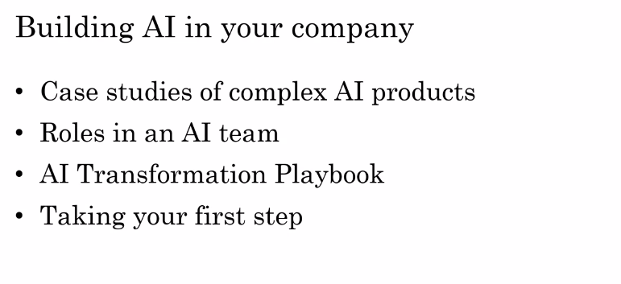</a>
	

### Case study: Smart speaker

* Case study of how you would write AI software to get a smart speaker to respond to a verbal command such as "Hey device, tell me a joke."
	* For this example, rather than using Alexa, or Okay Google, or Hey Siri, or Hello Baidu as the wake word or trigger word
			

			  <a href="javascript:void(0)" rel="noopener">
				 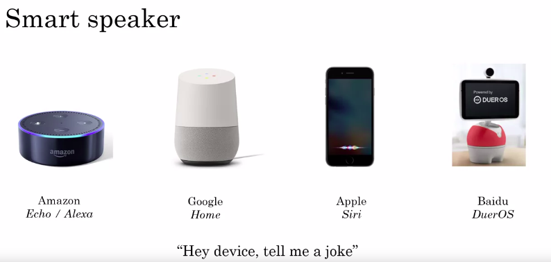</a>
			

* So how do you build a piece of AI software to understand a command like this and executes on it?
	* The steps needed to process the command
		1. __Step one__ is the trigger word or the wake word detection
			* The speaker uses a machine learning algorithm to input the audio clip and output
			* Did they just hear the wake word or the trigger word "Hey Device," so outputs 0 or 1
		1. Once it hears the trigger word or wake word, once it hears "Hey device," it then has to perform __Step two__, which is speech recognition
			* So what the software has to do is take the audio of what came after "Hey device" and map that to "Tell me a joke."
			* This is also done with machine learning
			* Whereas the first step here used an A to B mapping to just tell it that it heard the trigger word
				* this uses a different A to B mapping to map the audio to a text transcript of what you just said, which in this case is the four words: "tell me a joke"
			* Now, the algorithm has to figure out what you actually want by saying these four words
		1. the __third step__ is intent recognition
			* That means to take what have you said and to figure out what you actually wanted to do
			* So today's smart speakers have a limited set of commands such as they can tell a joke or they can tell the time
			* So you can say "Hey device what time is it." They can play music
				* They can sometimes help you make a phone call
				* They can tell you what's the weather, "Hey device, what's the weather tomorrow?"
			* So, what intent recognition does is take the four words, the speech recognition's output, and use another piece of AI software, another A to B mapping, that inputs those four words and outputs which of these five or other intents do you have
				* So in this implementation of a machine learning algorithm, the input A is the text transcript "tell me a joke" and the output B is which of these five types of commands did the user just utter
			* No matter how you ask the smart speaker to tell you a joke, hopefully, the intent recognition components will recognize your intent correctly
				* So that you can also say not just "Hey device, tell me a joke," but also "Hey device, do you know any good jokes" or "Hey device, tell me something funny."
				* Turns out, there are lot of ways for you to ask a smart speaker for a joke and a well-designed intent recognition system should recognize most of them
		1. __Fourth step__ is that there will be a software engineer that has written a piece of code to randomly select a joke and to play the joke back through the speaker
			* In other words, they'll execute a joke
	* You can think of the four steps of the algorithm as these four steps, where
		1. the first step is trigger word detectionhat's how we often organize projects within a large company.
		1. second step, speech recognition
		1. third step, intent recognition
		1. fourth step, execution of what are the command the user asked the smart speaker to execute
	* So the process of having four steps in an AI system like this or multiple steps, this is sometimes called an __AI pipeline__, where you have __multiple AI components__
		* it's possible to have machine learning components which process data one step after another
		* it would not be unusual to have, say, four different teams in the company where each team focuses on one of the components of this __AI pipeline__
		* That's how we often organize projects within a large company
				

				  <a href="javascript:void(0)" rel="noopener">
					 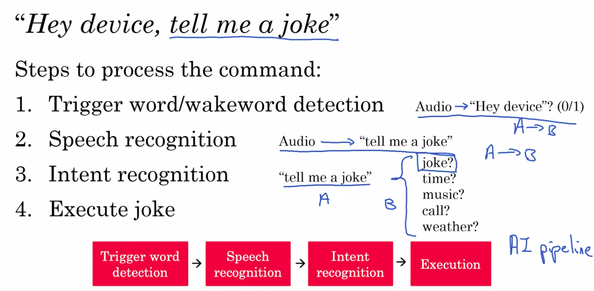</a>
				

* __Example__ : One of you issue a more complex commands like "Hey device, set timer for 10 minutes."
	* the steps needed to process the command
		1. First step, is trigger word detection. So input an audio and just let me know when someone said the trigger word hey device
		1. Second step, is speech recognition, where you input the rest of the audio and transcribe the rest of the sound, the rest of the audio, "set timer for 10 minutes."
		1. Third step, is intent recognition, has to input that text and output that your intent is that you want to set a timer
			* One difference between "set timer for 10 minutes" compared to the earlier example of "tell me a joke" is that you need to know how long to actually set the timer for
			* So in the execution step, you actually need to do two things
				1. One is extract the duration
					* That means, look at the text, set timer for 10 minutes and pull out the phrase that tells you how long to actually set the timer for
					* so if the user were to say "Hey device, let me know when 10 minutes is up," then this extract duration step would have to pull out, again, the 10 minute phrase right there
					*  And of course, there are lots of ways to ask for a 10-minute timer
						* You can also say, "let me know when 10 minutes are up" or "set an alarm for 10 minutes from now" and hopefully, the intent recognition and extract duration components will both be robust enough to recognize that all of these are different ways of asking for a 10-minute timer
				1. Start timer with set duration
					* Finally, to execute the command, there should be a specialized software component in the smart speaker that can start a timer with a set duration
					* after it has extracted your intent and the duration, it would just start the timer with that duration, so that the alarm goes off at the end of 10 minutes
* __Other functions__ of Smart Speakers
	1. Play music
	1. Volume up/down
	1. Make call
	1. Current time
	1. Unit conversion
	1. Simple question, etc...
* The __key steps__ of executing these commands are
	1. trigger word or the wake word detection
	1. speech recognition to transcribe the text in the command
	1. intent recognition to figure out which of these functions or which of these commands you want to execute
	1. a specialized program to execute whichever command you uttered
* __One of the challenges__ of the __smart speaker__ world is that
	* if you want your smart speaker to have this many different functions, say, 20 different functions, then you do need software engineering teams to write 20 specialized pieces of software
	* One to play music, one to set the volume, one to make calls, one to ask for the current time, one to convert units like from teaspoons to tablespoons, or to answer very simple questions, and on and on
	* So it's actually quite a lot of work to write all of these specialized programs to execute all the different commands you might want to execute in step four
	* smart speakers today actually do so many things that is difficult for many users to keep straight in their heads exactly what they can and cannot do
		* So many smart speaker companies have been investing a lot in user training to try to let users know what are the things that smart speakers can do
				

				  <a href="javascript:void(0)" rel="noopener">
					 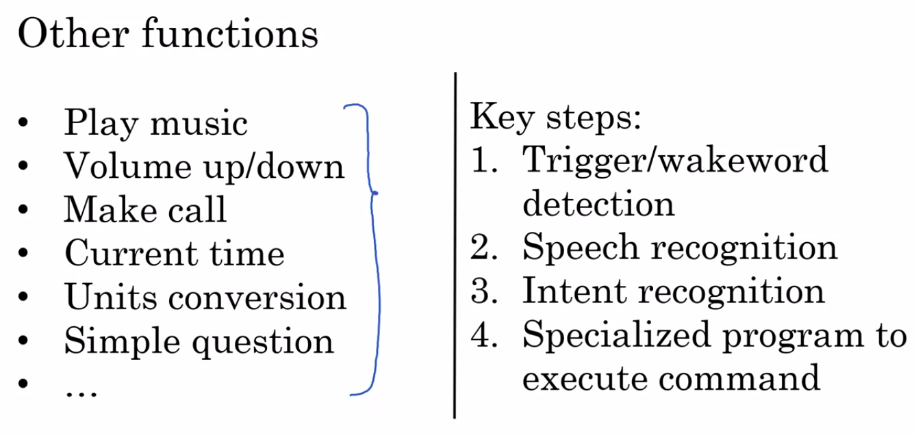</a>
				

### Case study: Self-driving car

* One of the most exciting products of the AI era is the self-driving car
* Self-driving cars are also one of the most mysterious things you hear about in AI these days
* The key steps for deciding how to drive your self-driving car
	1. Image/Radar/Lidar
		* The car will take as input various sensors such as pictures of what's in front of the car or to the sides or behind, as well as maybe radar or Lidar meaning laser sensor readings
		* Given these inputs of a picture and maybe other things, it then has to detect other cars
		* So given that, hopefully, you'll figure out there's a car there ( as shown in image below ), as well as where are the pedestrians, because we want to avoid other cars as well as avoid pedestrians
		* Both car detection and pedestrian detection can be done with machine learning using input/ output or A to B mappings that takes as input the picture and maybe radar and Lidar, sends the inputs and tells us where are the other cars and pedestrians
	1. Motion Planning
		* Finally, now that you know where are the other cars and where are the pedestrians, you can then feed this information into another specialized piece of software, it's called a __motion planning piece of software__
			* This software plans the motion or plans the path that you want your car to take, so that you can make progress to your destination while avoiding any collisions
	1. Steer/Accelerate/Brake
		* Once you've planned out the motion for your car, you can then translate that into specific steering angle for your steering wheel and acceleration and brake commands, so how much to step on the gas pedal, and how much to brake in order to get your car to move at the desired angle as well as speed
				

				  <a href="javascript:void(0)" rel="noopener">
					 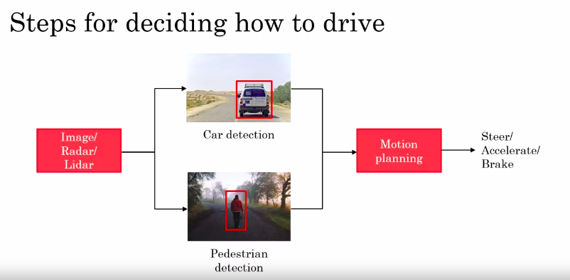</a>
				

* __Key Steps__
	1. __Car Detection__
		* Car detection uses supervised learning
		* So, you've already seen how a learning algorithm can take as input pictures like these ( as shown in image below ) and output the detected cars
		* For most self-driving cars rather than using only a front-facing camera, so a camera that looks forward, also often use cameras that look to the left, to the right as well as to the back so it can detect cars not just to the front but all around it
			* This is usually done using not just cameras but other sensors as well such as radar and Lidar
				

				  
				

	1. __Pedestrian Detection__
		* Using a pretty similar type of sensors as well as techniques, self-driving cars can detect pedestrians (like used in Car Detection step)
				

				  <a href="javascript:void(0)" rel="noopener">
					 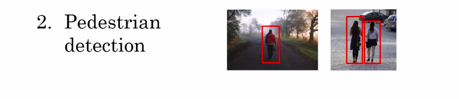</a>
				

	1. __Motion Planning__
		* Example 1
			* Let's say you're driving your car and there's this light blue car in front of you
			* The motion planning software's job is to tell you what is the path, shown here in red, you should drive in order to follow the road and not have an accident
			* So the motion planning software's job is to output the path as well as speed at which you should drive your car in order to follow the road
				* the speed should be set so that you don't run into the other car, but you also drive at a reasonable speed on this road
		* Example 2
			* If there's this gray car parked on the right side of the road, so you want to overtake this stopped car
				* then the motion planning software's job is to plot a path like that to let you veer a little bit to the left and safely overtake a stopped car
					

					  
					

* Steps for deciding how to drive
	* This is a picture you've seen so far --> Input image, radar, or Lidar, sensor readings into car detection and pedestrian detection, and that is then fed to motion planning to help you select your path and speed
					

					  <a href="javascript:void(0)" rel="noopener">
						 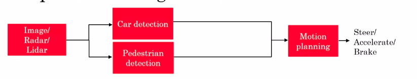</a>
					

	* Now in a real self-driving car, you would usually use more than just cameras, radar, and Lidar
		* Most self-driving cars today will also use
			1. __GPS__ to sense its position
			1. __accelerometers__, sometimes called an __IMU__, this means accelerometers
			1. __gyroscopes__
			1. a __map__ because we know that __cars__ are more likely to be found on a __road__, __pedestrians__ are more likely to be found on __sidewalks__, although they are sometimes found on the road as well
		* All this is usually additional information that's fed in to detect cars and pedestrians as well as other objects we'll talk about in a second
		* Rather than just detecting cars and pedestrians, in order to drive safely you also need to know where these cars and pedestrians are going in the future
			* So, another common component of self-driving cars is trajectory prediction, where there's another AI component that tells you not just the cars and pedestrians you found, but also where they're likely to go in the next few seconds, so you can avoid them even as they're moving
		* To drive safely requires more than just navigating other cars and pedestrians. You also need to know where are the lanes so you might detect lane markings
		* If there's a traffic light you also need to figure out where's the traffic light, and is it showing a red, yellow, or green signal
		* Sometimes there are other obstacles, such as unexpected traffic cones or maybe there's a flock of geese walking in front of your car
		* That needs to be detected as well so that your car can avoid even other obstacles than cars and pedestrians
		* On a large self-driving car team, it would not be that unexpected to have a team or maybe a few people working on each of the boxes shown here in red, and it's by building all of these components and putting them together that you can build a self-driving car
					

					  <a href="javascript:void(0)" rel="noopener">
						 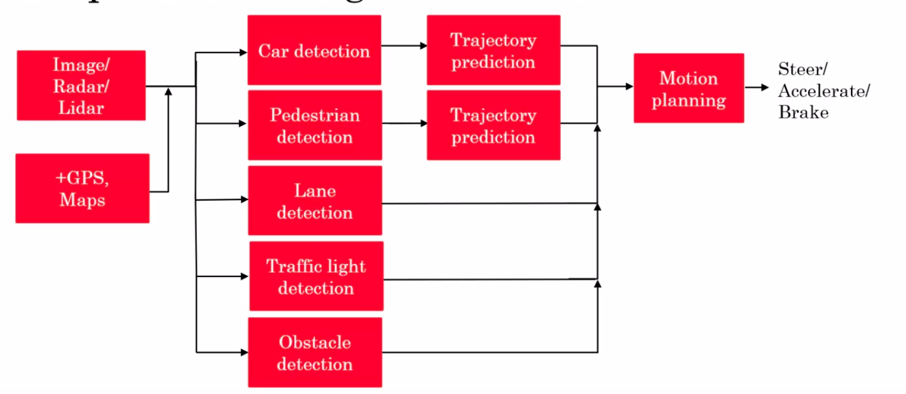</a>
					

### Example roles of an AI team

* Some AI products may require a large AI team, maybe you have a 100 engineers or sometimes many more than a 100 to build
* One caveat, because AI is evolving so fast, the job titles and various responsibilities are not yet a 100 percent defined, and they are a little bit different across different companies
* Example Roles
	1. Software Engineers
		* Many AI teams will have Software Engineers in them
		* So, for example, for the smart speaker we needed to write specialized software to execute on the joke or to set a timer or to answer questions about today's weather
			* So, those are traditional software engineering tasks
		* So, for example, you're building a self-driving car to make sure that your self-driving car software is reliable and doesn't crash
			* These are software engineering tasks
		* So, it's not uncommon for AI teams to have enlarged fractions sometimes 50 percent, sometimes much much much more than 50 percent of Software Engineers in them
	1. Machine Learning Engineer
		* So, Machine Learning Engineer might write the software responsible for generating the A to B mapping or for building other machine learning algorithms needed for your product
		* So, they might gather the data of pictures of cars and positions of cars, train a neural network or train a deep learning algorithm and work iteratively to make sure that the learning algorithm is giving accurate outputs
	1. Machine Learning Researcher
		* The typical row of the Machine Learning Researcher is to extend the state of the art in machine learning
		* Machine learning and AI more broadly are still advancing rapidly
		* So, many companies for profit and non-profit, more have Machine Learning Researchers responsible for extending the state-of-the-art
		* Some Machine Learning Researchers will publish papers, but many companies also have Machine Learning Researchers that do research, but are less focused on publishing
	1. Applied Machine Learning Scientists
		* Applied Machine Learning Scientists, which live somewhere between Machine Learning Engineer and Machine Learning Researcher
		* The Machine Learning Scientists kind of does a bit of both
		* They are often responsible for going to the academic literature or the research literature and finding the steady VR techniques and finding ways to adapt them to the problem they are facing such as how to take the most cutting edge, trigger where the wicker detection algorithm and adapt that to your smart speaker
					

					  <a href="javascript:void(0)" rel="noopener">
						 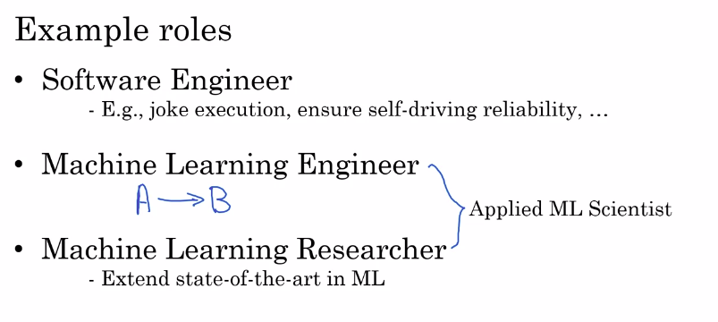</a>
					

	1. Data Scientists
		* Today, there are a lot of Data Scientists working in industries
		* The role of Data Scientist is not very well defined and the meaning is still evolving today
		* One of the primary responsibilities of Data Scientists is to examine data and provide insights, as well as to make presentations to teams or the executives in order to help drive business decision-making
		* There also Data Scientists today doing other tasks
		* So, there are also Data Scientists today whose work looks more like the Machine Learning Engineers
	1. Data Engineers
		* With the rise of big data, there are also more and more Data Engineers
		* Data Engineers whose main role is to help you organize your data
			* meaning, to make sure that your data is saved and is easily accessible, secure and cost-effective way
		* So, why is saving data such as a big deal? Can't you just save them in a hard disk and be done with it
			* In some companies, data volumes have gotten so big. There's actually quite a lot of work to manage them
		* To give you a sense of the scale, in computer science one MB stands for one megabytes and so a typical song on your music player like a typical MP3 file may be a few megabytes, say five megabytes would be a non unusual MP3 file size
			* A 1,000 megabytes is called a gigabyte. A million megabytes is called a terabyte and a billion megabytes is called a petabyte
			* With today's hard disk sizes, saving a few megabytes is not a big deal. It's just like a mere MP3 file, but storing a 1,000 megabytes, also called a gigabyte, starts to be a bit slower
			* A typical hour-long movie that you stream over the internet maybe above gigabytes. So, that's quite a lot of data
			* To give you a sense of the scale, a self-driving car may collect multiple gigabytes of information every single minute of operations
				* So, it's as if every minute the self-driving car generates enough data to store multiple hour-long movies
			* So, self-driving cars actually generate lot of data and saving the data for many days or weeks or months or years of operation starts to require serious data engineering
		* Other than pretty large internet companies is not that common for a company to generate multiple petabytes of information per day
		* As you move down this scale to bigger and bigger datasets, it becomes harder and harder to make sure that data is stored in a easy accessible, secure and cost-effective way, which is why Data Engineers become more and more important
	1. AI Product Managers
		* AI Product Managers whose job is to help decide what to build
			* In other words, they help to figure out what's feasible and valuable
		* Traditional Product Manager's job was already to decide what to build as well as sometimes some other roles
			* but the AI Product Manager now has to do this in the AI era and they're needing new skill sets to figure out what's feasible and valuable in light of what AI can and cannot do today
		* Because the field of AI is still evolving, none of these job titles are completely nailed down in the stone and different companies will use these job titles somewhat differently
					

					  <a href="javascript:void(0)" rel="noopener">
						 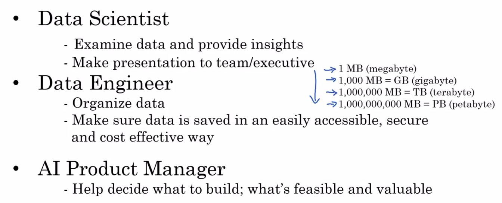</a>
					

* You can get started with a small team. You don't need a 100 people to do most AI projects
* So, whether you just have one Software Engineer working with you, or just a single Machine Learning Engineer, or just a single Data Scientists, or maybe nobody, but yourself, if either you or an engineer working with you has taken some online courses on machine learning or deep learning or data science, that's often enough for you by yourself or for you and an engineer to start looking at some smaller volumes of data, start drawing some conclusions or start trading some machine learning models to get going
					

					  <a href="javascript:void(0)" rel="noopener">
						 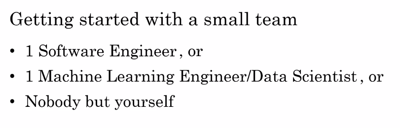</a>
					

### AI Transformation Playbook (Part 1)

* The __five steps__ of the __AI transformation playbook__
	1. __Step one__ is for your company to execute pilot projects to gain momentum
		* Start to know what it feels like to work on AI projects
	1. __Step two__, is to build an in-house AI team
	1. __Step three__, is to provide broad AI training
		* not just the engineers but to many levels within a company including executives
	1. __Step four__, is to develop your AI strategy
	1. __Step five__, is to develop internal and external communications about your company and AI
* The way your company will execute the steps may not be totally sequential and so the different steps may overlap
	* But this numbering gives a maybe rough sense of the order in which you could do these steps
					

					  <a href="javascript:void(0)" rel="noopener">
						 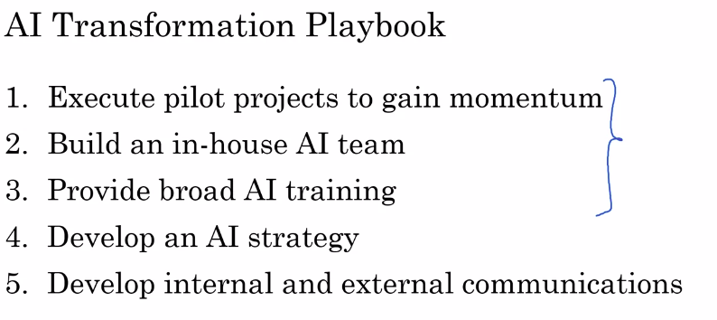</a>
					

1. __Executing Pilot Projects to Gain Momentum__
	* If you want your company to gain momentum with AI, the most important consideration for the initial project or projects, is for them to be successful rather than necessarily be the most valuable
	* So, when selecting your initial project, try to pick something that you think has a good chance of success
	* They can start to fly wheel turning even if it may not be the most valuable project that you could eventually do for the company
		* Because the goal of the first few projects is just to gain momentum is also now you see if you can pick something that can show traction within 6 to 12 months
		* So you can start to fly wheel turning quickly
	* Finally, your first one or two pilot projects can be either in-house or outsource
		* If you do not yet have a large in-house AI team, might be possible, might even be advisable to outsource some or all of your first couple of AI projects in order to get more expertise in house and to let you start building that momentum faster
	* Now, beyond a certain point, you will need your own in-house AI team to execute a long-term sequence of maybe many dozens of AI projects
					

					  <a href="javascript:void(0)" rel="noopener">
						 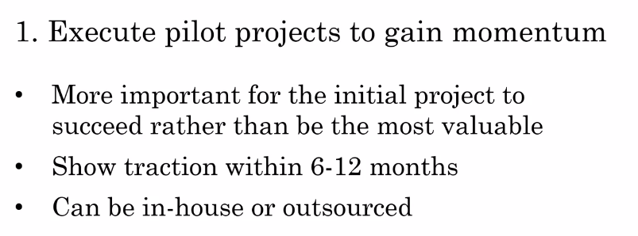</a>
					

1. __Build an In-house AI Team__
	* A lot of companies are organized like this, where, there's a CEO and multiple business units (BU) that reports up to the CEO
	* So, what is recommended for most companies is to build a centralized AI team and then to take the talent in the matrix organization and to matrix them into these different business units to support their work
	* Why essentialize the AI?
		* Let's take an example
			* Maybe this unit is your gift card business unit, and the BU leader may be great at whatever he or she does
				* They may be greater than gift card business
				* But unless he or she is knowledgeable AI and knows how to build retain and managing AI team, it may be very difficult for that business unit leader to hire and retain an appropriately manage their own AI talent
					* So, in that case, I think you also successfully much higher if you find that AI team leader that can be responsible for consistent company wise standards for recruiting, retention
				* Have essentialized AI team to give the team the community to talk to each other about how AI applies to your business radical
				* It may be more efficient to take the AI talent in your centralized AI unit and matrix them into the gift card business unit so that your AI talent can work together with the gift card domain experts in order to develop interesting AI projects together
	* One other responsibility for the AI unit, is to build a company wide platforms
		* If there are software platforms or other tools or data infrastructure that could be useful for the whole company
			* then a single business unit may not have the resources or the incentive to build these company-wide platforms and resources that can support the whole company but essentialized AI team maybe help built these company wide tools or platforms that can help multiple business units
	* Finally, this new AI business unit can be under the CTO, the CIO, the chief data officer or the Chief Digital Officer or it could also be under a new chief AI officer
		* The CAIO or chief AI officer is a role that I'm seeing more and more often in different companies but if some other senior executive has the right skill set, they could also manage the AI unit
	* Finally, one last recommendation, which is that, it is hopeful if to get the AI units started the company or the CEO provides funding to build at the AI unit rather than required AI unit to get funding from the business units
		* Eventually, after the initial investment and after the initial ramp up, the AI unit will have to show his value that is creating for the business units but having CEO inject funding at the outset so they can get going, will often help you get that initial momentum much faster
					

					  <a href="javascript:void(0)" rel="noopener">
						 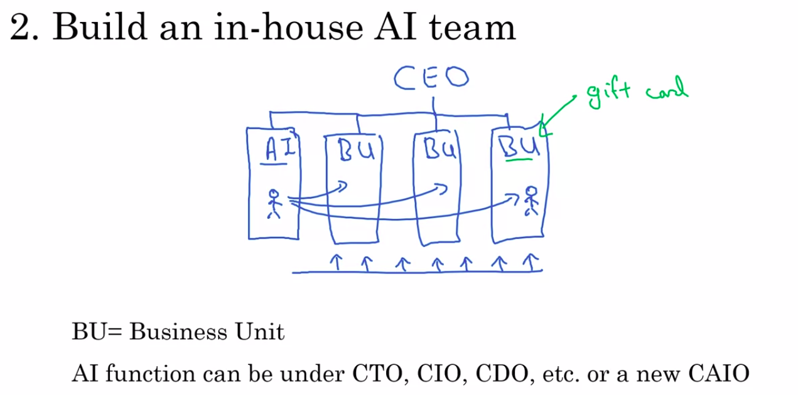</a>
					

1. __Provide Broad AI Training__
	* Now, for accompany that become good at AI, is not just that you need engineers to know AI, you need multiple people at multiple levels of the company to understand how AI interacts with their roles
	* For example
		* for executives and senior business leaders, I (Andrew NG) recommend that they learn what AI can do for your enterprise, that they learned the basics of these of AI strategy and they learned enough about AI to make resource allocation decisions
	* Leaders of divisions work on AI projects also need to know how to interact in their role with AI
		* These leaders would need to understand how to set project directions
		* So how the conduct technical and business diligence
		* How to make resource allocation decisions at the division level
		* How to track and monitor progress of AI projects
	* Finally, many companies are hiring AI talent from outside but I will also not underestimate the importance and the impact of training of your existing engineering workforce with AI skills for a software engineer to become proficient at AI does take a while so plan for maybe at least a 100 hours of training
	* Many companies provide training to help engineers learn to build and ship AI software to gather and managed data as was helped them become effective at executing on specific AI projects
	* The world today does not have nearly enough AI engineers and so in-house training is a key part of many companies building up of their in-house AI capabilities
					

					  <a href="javascript:void(0)" rel="noopener">
						 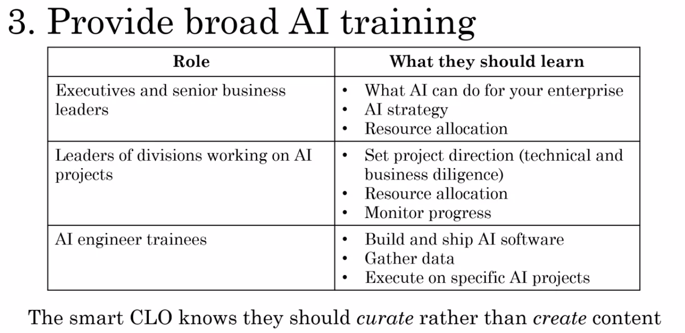</a>
					

* There is a lot of great content online about all of these subjects and I think a good CLO should work of experts to curate this type of content and motivated teams to complete these learning activities rather than necessarily create contents which is much more expensive thing to do

### AI Transformation Playbook (Part 2)

1. __Develop AI Strategy__
	* It may mean to leverage AI to create an advantage specific to your industry sector
	* One unusual part of this playbook is that developing the AI strategy is step four not step one
	* Companies that tried to define the strategy as step one, before getting your feet wet, before trying out AI knowing what a feasibility AI project
		* Companies like that tend to end up with sometimes very academic strategies that are sometimes not true to life
	* In addition, you might consider designing a strategy that is aligned with the virtuous cycle of AI
		* Lets illustrate that with an example from web search
			* One of the reasons that web search is a very defensible business, meaning is very difficult for new entrants to compete with the incumbents with the existing large web search engines, is this:
				* If a company has a better product, maybe a slightly better product, then that web search engine can acquire more users
				* Having more users means that you collect more data because you get to observe what different users click on when they search for different terms, and that data can be fed into an AI engine to produce an even better product
		* So, this means that the company with somewhat better product, ends up with even more users, ends up with even more data, and does an even better product with this link being created by modern AI technology
		* It makes it very difficult for a new entrant to break into this self-reinforcing positive feedback loop, called __the virtuous cycle of AI__
		* Fortunately though, this virtuous cycle of AI can be used by smaller teams entering new verticals as well
					

					  <a href="javascript:void(0)" rel="noopener">
						 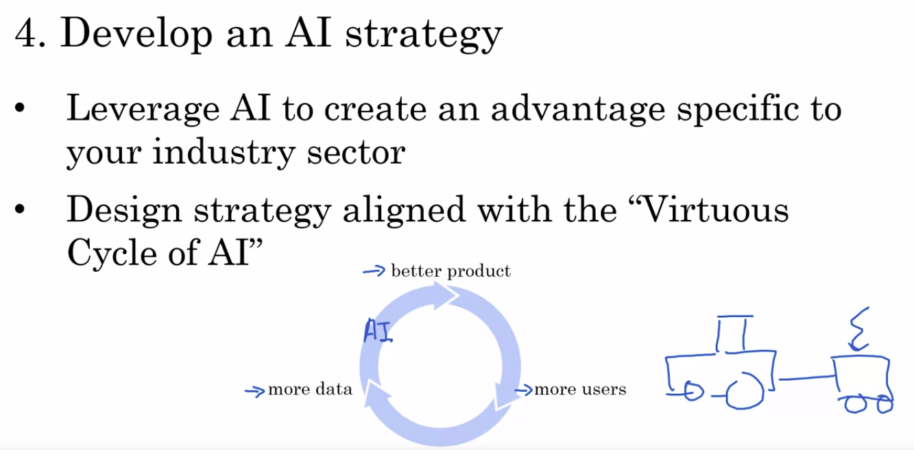</a>
					

		* Example
			* There is a company called Blue River that was acquired by John Deere for over US$300 million, and Blue River makes agricultural technology using AI
				* So, what they did was build these machines that would be towed behind a tractor, in a big agricultural fields
				* This machine would take pictures of crops and figure out which is a crop and which is a weed, and use precision AI to kill off just the weeds, but not the crop
				* So, to get the project started, they actually just use strap in his and sweat, they use their personal cameras and went out to a bunch of farms, and took a lot of pictures of crops in these agricultural fields
				* So, they started to collect pictures of heads of cabbage and weeds around the cabbage
				* Once they had enough data, starts off with a small data set, they could train a basic product
				* The first product, frankly wasn't that great
					* It was trained on a small data set, but it worked well enough to start to convince some farmers, some users to start to use their product, to tow this machine behind the tractor, in order to start killing weeds for the farmers
				* Once this thing was running around the farms through the process of taking pictures of heads of cabbage and killing off weeds, they naturally acquired more and more data
				* Over the next few years, what they did was they were able to enter this positive feedback loop, where having more data allows you to have a better product
					* Having a better product allows you to convince more farmers to use it
					* Having farmers use it allows you to collect more data
				* Over several years, entering a virtuous cycle like this, can allow you to collect a huge data asset that then makes your business quite defensible
				* In fact, at the time of acquisition, they had a much bigger data asset of pictures of heads of cabbage lying on a field than even the large tech companies had, and does actually makes the business relatively defensible from even the large tech companies that have another web search data, but do not have nearly as many pictures as this company does of heads of cabbage lying in the agricultural fields
					

					  <a href="javascript:void(0)" rel="noopener">
						 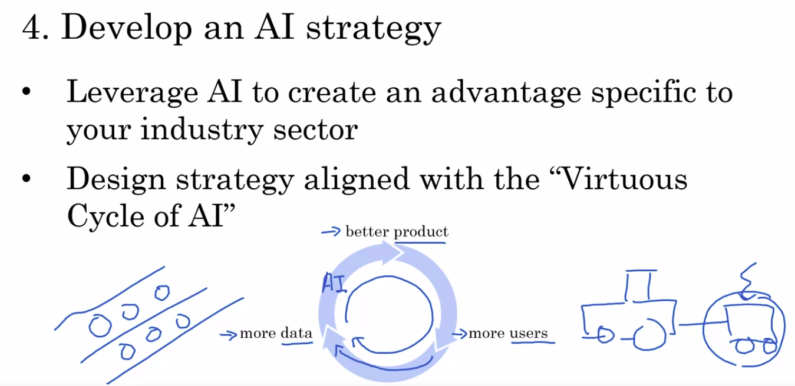</a>
					

	* Other elements of an AI strategy
		* We are going to live in an AI power world and the right strategy can help your company navigate these changes much more effectively
		* You should also consider creating a data strategy
			* Leading AI companies are very good at strategic data acquisition
		* For example, some of the large consumer facing AI companies will launch services, like a free email service, or a free photo-sharing service, or many other free services that do not monetize, but allows them to collect data in all sorts of ways that lets them learn more about you, so they can serve you more rather than adds, and thereby monetize their data in a way that is quite different than direct monetization about that product
		* The way you acquire data is very different depending on your industry vertical
		* You might also consider building a unified data warehouse
			* If you have 50 different data warehouses under the control of 50 different vice presidents, then is almost impossible for an AI engineer or for a piece of AI software to pull together all of this data in order to connect the dots
			* For example
				* if the data warehouse for manufacturing is in a totally different place than the data warehouse for customer complaints, then how can an AI engineer pull together this data to figure out, whether the things that might happen in manufacturing, that causes you to ship a faulty cell phone, that causes a customer to complain two months later
			* So, a lot of leading AI companies have put a lot of upfront effort into pulling the data into a single data warehouse because this increases the odds that a engineer or a piece of software, can connect the dots and spot the patterns between how a elevated temperature in manufacturing today may result in a faulty device that leads to a customer complaint two months in the future, thus letting you go back to improve your manufacturing processes
		* You can also use AI to create network effects and platform advantages
		* In industries with winner take all dynamics, AI can be a huge accelerator
			* For example
				* take the ride-sharing or the ride-hailing business. Today, companies like Uber, and Lyfts, and Ola, and DiDi, and Grab seemed like they have relatively defensible businesses because they are platforms that connect drivers with passengers, and is quite difficult for a new entrant to accumulate both a large rider audience and a large passenger audience at the same time
		* Social media platforms like Twitter and Facebook are also very defensible because they are very strong network effects where having a lot of people on one platform makes that platform more attractive to other people
			* So, it's very difficult for a new entrant to break in
		* If you are working in a business with these types of "winner take all dynamics" or "winner take most dynamics", then if AI can be used to help you we're growing faster
			* For example
				* with a celebrating user acquisition, then that can pass translates into a much bigger chance that your company will be the one to succeed in this business vertical
					

					  <a href="javascript:void(0)" rel="noopener">
						 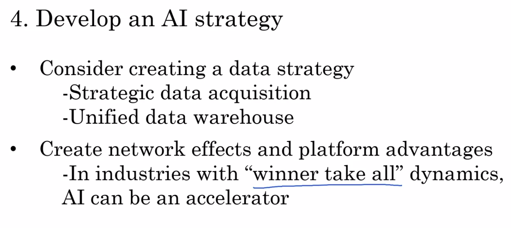</a>
					

		* Strategy is very company and industry and situation specific
			* So, it's hard to give strategy advisers completely general to every single company
			* Hopefully these principles give you a framework for thinking about what might be some key elements of an AI strategy for your company
		* AI can also fit into more traditional strategy frameworks
			* If your company has a low-cost strategy, then perhaps AI can be used to reduce costs for your business
			* If your company has a high value strategy to deliver really, really valuable products with a higher cost, then you might use AI to focus on increasing the value of your products
		* So, AI capabilities can also help argument existing elements of a broader corporate strategy
		* Lastly, as you're building these valuable and defensible businesses, I hope that you also build only businesses that make people better off
			* AI is a superpower. This is a very powerful thing that you can do to build a great AI company, and so I hope that whatever you do, you do this only in ways that make humanity better off
1. __Develop internal and external communications__
	* AI can change a company and its products, and its important to communicate appropriately with the relevant stakeholders about this
		* For example
			* this may include investor relations to make sure that your investors can value your company appropriately as an AI company
	* Investor relations may also includes government relations
		* For example
			* AI is entering health care, which is a highly regulated industry because government has a legitimate need to protect patients, and so for AI to affect these highly regulated industries, it is important for companies to communicate with government, and to work collaboratively with them in public-private partnerships to make sure that AI solutions bring people the benefits it can, while also making sure that governments can protect consumers and protect patients
		* So, this would be true for health care or be true for self-driving cars, it would be true for finance and many other AI industry vertical
	* If your products change, then consumer or user education will be important
	* AI talent is very scarce into this world and so, if you are able to showcase some of your initial successes that could really help with talent and recruiting
	* Finally, internal communications is also important if you're making a shift in your company, then many people internally may have worries, some legitimate and some less rational about AI and internal communications, so reassure people where appropriate can only be helpful
					

					  <a href="javascript:void(0)" rel="noopener">
						 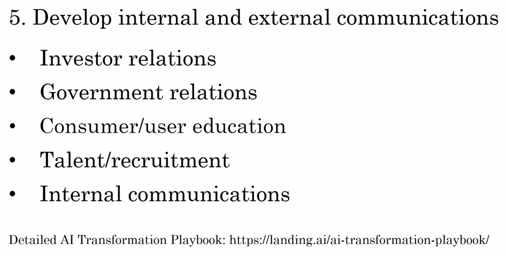</a>
					

### AI pitfalls to avoid

* Let's go over a five don'ts and dos for if you're trying to build AI for your company
	1. First one, don't expect AI to solve everything
		* You already know that AI can do a lot but there's also lots AI cannot do
		* Instead, you should be realistic about what AI can or cannot do, given the limitations of technology, data, and engineering resources
		* That's why technical diligence in addition to business diligence is important for selecting feasible and valuable AI projects
	1. Second, don't just hire two or three machine learning engineers and count solely on them to come up with use cases for your company
		* Machine learning engineers are a scarce resource, but you should instead pair the engineer talents with business talent and work cross-functionally to find feasible and valuable projects
		* Is often the combination of the machine-learning talents worked to business talent that can select the most valuable and feasible projects
					

					  <a href="javascript:void(0)" rel="noopener">
						 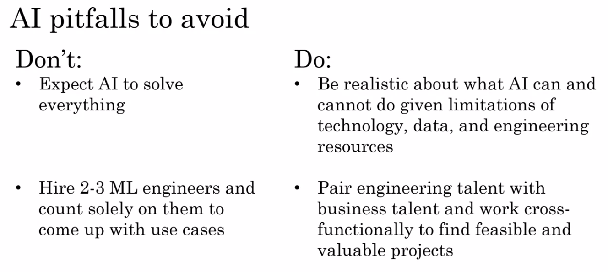</a>
					

	1. Third, don't expect AI project to work the first time
		* As you've already seen, AI development is often an iterative process so should plan for it through an iterative process with multiple attempts needed to succeed
	1. Fourth, don't expect traditional planning processes to apply without changes
		* Instead, you should work with the AI team to establish timeline estimates, milestones, KPIs or metrics that do make sense
		* The types of timeline estimates, milestones, and KPIs or metrics associated with AI projects are a bit different than the same things associated with non-AI projects
			* So, hopefully working with some individuals knowledge about AI can help you come up with better ways of planning AI projects
	1. Finally, don't think you need superstar AI engineers before you can do anything
		* Instead, keep building the team and get going with a team you have realizing that there are many AI engineers in the world today including many that have learned primarily from online courses
			* They can do a great job building valuable and feasible projects
					

					  <a href="javascript:void(0)" rel="noopener">
						 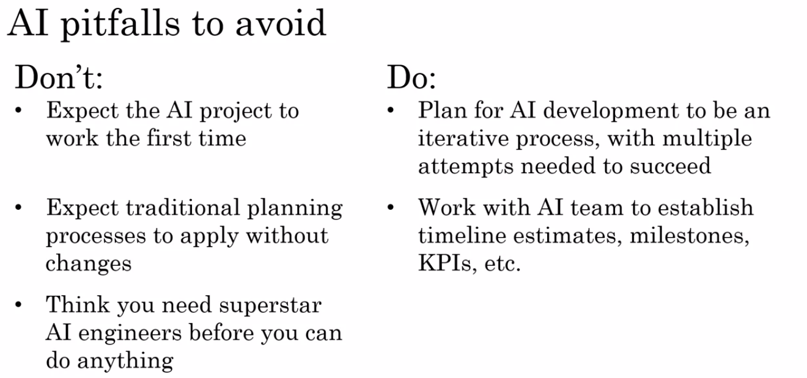</a>
					

### Taking your first step in AI

* Some initial steps you can take
	* Rather than going it alone, consider having friends in your company or personal friends outside work to learn about AI with you
		* This could mean, asking them to take this course with you or after you, or starting a reading group to read some books or other materials about AI
	* With what you've learned in this course, you will also, especially if you have engineering friends, be able to start brainstorming projects
		* No project is too small and it's better to start small and succeed, than to start too big and not succeed
		* Many projects can be done just by you or perhaps by you and a friend
			* If you and or a friend take an online course on machine learning, that's enough know-how for you to get started on many potentially very valuable AI projects
	* In a company, you might also hire a few machine learning or data science people to help out, in addition to providing in-house training to develop the in-house talent
	* When you're ready to go bigger, you might also try to have your company hire or appoint an AI leader, such as a VP of AI or a Chief AI Officer
		* But maybe you don't need a very senior AI leader before hiring just a few machine learning or data scientists people to get going more quickly
	* If you want your company to become greater AI, you would also consider trying to discuss with your CEO, the possibility of trying to execute an AI transformation
		* The key question to ask your CEO or your Board is, will your company be much more valuable and/or much more effective if it was great at AI
		* if you and they think the answer is yes, that might be a good reason for the company to try to execute an AI transformation
					

					  <a href="javascript:void(0)" rel="noopener">
						 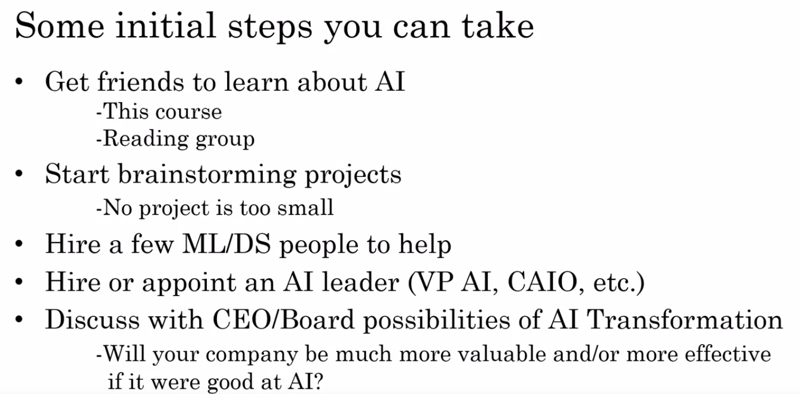</a>
					

### Survey of major AI application areas (optional)

* AI today is being successfully applied to image and video data, to language data, to speech data, to many other areas
* __Computer Vision__
	* One of the major successes of deep learning has been Computer Vision
	* Image classification and object recognition refer to taking as input a picture like (as shown in image below) that and telling us what is in this picture
		* In this case, it'd be a cat
					

					  
					

	* Rather than just recognizing cats, AI algorithms are able to recognize specific types of flowers, AI able to recognize specific types of food and the ability to take as input a picture and classify it into what type of object, and this is being used in all applications
	* One specific type of image classification that has had a lot of traction is __face recognition__
		* This is how face recognition systems today work
			* A user might register one or more pictures of their face to show the AI what they look like
			* Given a new image, the AI system can then say is this the same person? Is this you? Or is this a different person so that it can decide a decision, unlock the door or unlock the cell phone, unlocked the laptop or something else based on the identity of the person
		* face recognition will only be used in ways that respect individuals privacy
	* A different type of computer vision algorithm is called __object detection__
		* So, rather than just tried to classify or recognize an object, you're trying to detect if the object appears
		* For example
			* In building a self-driving car, we've seen how an AI system can take as input a picture like this and not just tell us yes or no, is there a car. Yes or no, is there pedestrian but actually tells us the position of the cars as well as the positions of the pedestrians in this image
		* Object Detection Algorithm can also take as input a picture like that and just say, no I'm not finding any cars or any pedestrians in that image
		* So rather than taking a picture and labeling the whole image which is image classification, instead an object detection algorithm will take us input an image and tell us where in the picture different objects are as was what are the types of those objects. Image segmentation takes this one step further
	* Given an image like this ( as shown in image below ), an __image segmentation algorithm__ we output, where it tells us not just where the cars and pedestrians but tells us for every single pixel, is this pixel part of this car or is this pixel part of a pedestrian
		* So it doesn't just draw rectangles around the objects and detects, instead it draws very precise boundaries around the objects that it finds
		* So, in reading x-rays
			* or example, it would be an image segmentation algorithm that could look at an x-ray scan or some other image of a human body and carefully segment out, where's the liver or where's the heart or where is the bone in this image
					

					  <a href="javascript:void(0)" rel="noopener">
						 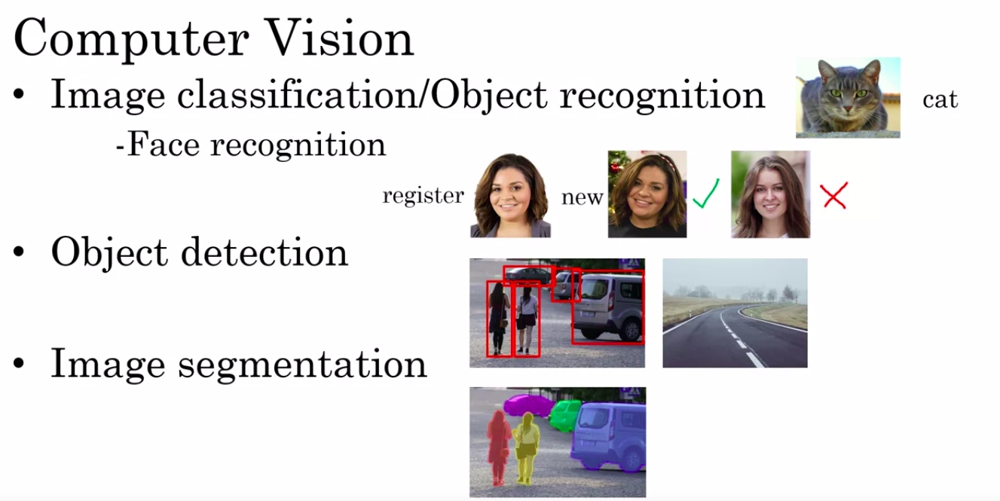</a>
					

	* Computer vision can also deal with video and one application of that is __tracking__
		* In this example, rather than just detecting the runners in this video ( as shown in image below), it is also tracking in a video whether runners are moving over time
		* So, those little tails below the red boxes show how the algorithm is tracking different people running across several seconds in the video
		* So, the ability to track people and cars and maybe other moving objects in a video helps a computer figure out where things are going
		* If you're using a video camera to track wildlife for example, say birds flying around, a tracking algorithm will also be the helper track individual birds flying across the frames of your video
	* These are some of the major areas of computer vision and perhaps some of them will be useful for your projects
					

					  <a href="javascript:void(0)" rel="noopener">
						 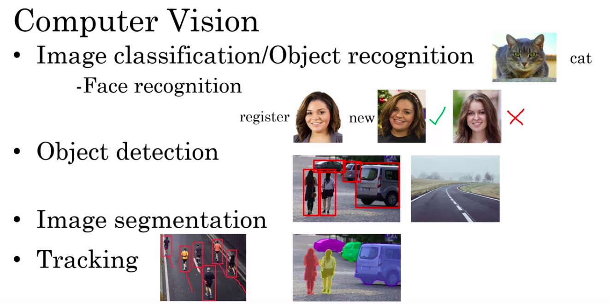</a>
					

* __Natural Language Processing or NLP__
	* AI and deep learning specifically is also making a lot of progress in Natural Language Processing. Natural Language Processing or NLP refers to AI understanding natural language
		* meaning the language that you and I might use to communicate with each other
	* One example is text classification where the job of the AI is to input a piece of texts such as an email and tell us what is the cause or what is the category of this email, such as a spam or non-spam email
	* There are also websites that would inputs a product description
		* For example
			1. you might write, I have a secondhand cellphone for sale and automatically figure out what is the product category in which the list is product
				* So, that would go under cellphones or electronics
			1. if you write, I have a new t-shirt to sell then it would list it automatically under clothing
	* One type of text classification that has had a lot of attention is __sentiment recognition__
		* For example
			1. a sentiment recognition algorithm can take as input a review like this of a restaurant, the food was good and automatically tries to tell us how many stars this review might get
				* The food was good as a pretty good review maybe that's four over five-star review
				* Whereas if someone writes service was horrible, then the sentiment recognition algorithm should be able to tell us that this corresponds maybe to a one-star review
	* A second type of NLP or Natural Language Processing is __information retrieval__
		* Web search is perhaps the best known example of information retrieval where you type in the text query and you want the AI to help you find relevant documents
		* Many corporations will also have internal information retrieval systems where you might have an interface to help you search just within your company's set of documents for something relevant to a query that you might enter
	* __Name entity recognition__ is another natural language processing technology
		* Exampel
			* Say you have this ( as shown in image below ) sentence and you want to find all the people names in the sentence
				* So, Queen Elizabeth the second is a person, Sir Paul McCartney as a person
				* So, the sentence Queen Elizabeth, the second night to Paul McCartney for a service of music at the Buckingham Palace, it would be a name entity recognition system to confine all the people's names in the sentence
		* If you want to find all the location names, all the place names in a sentence like that, a named entity recognition system can also do so
		* Name entity recognition systems can also automatically extract names of companies, phone numbers, names of countries
			* if you have a large document collection and you want to find automatically all the company names, or all the company names the occur together or all the people's names, then a name entity recognition system would be the tool you could use to do that
	* Another major AI application area is __Machine Translation__
		* So, for example, if you see this sentence in Japanese, AI ( as shown in image below )
			* Then hopefully a machine translation system can input that and output the translation AI is in the electricity
	* The four items : text classification, information retrieval, name entity recognition, and machine translation, are four major categories of useful NLP applications
					

					  <a href="javascript:void(0)" rel="noopener">
						 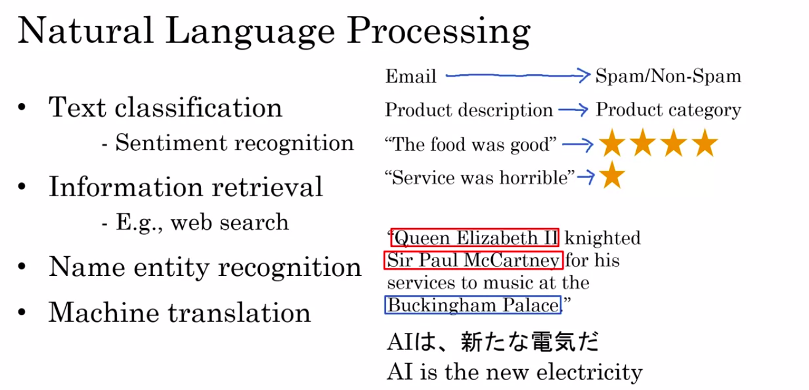</a>
					

	* If you work with an NLP team you may also hear them talk about parsing and part of speech tagging technologies
		* Let's take the example sentence, "The cat on the mat"
		* A part-of-speech tagging algorithm will go through all the words and tell you which of these words are nouns, which of these words are verbs, and so on
			* For example
				* In the English language cat and mat in the sentence are nouns
					* So, the part of speech tagger we'll label these two words as nouns
					* According to the theory of English language, the word the is a determiner
					* So, part of speech tagger will label these words like that
		* If you're building a sentence classifier for restaurant reviews, then a part-of-speech tagging algorithm would be able to tell you which are the nouns, which are the verbs, which are the adjectives, which are the adverbs, and so on
			* therefore, help your AI system figure out which of the words to pay more attention to
			* For example
				* you should probably pay more attention to the nouns since those seem like important words
				* Maybe the verbs
				* Certainly the adjectives, words like good, bad, delicious are adjectives, and your AI system may learn to ignore the determiners
					* Words like "the" which may be matter less in terms of how a user is actually feeling about the restaurant
		* A part of speech tagging system is usually not a final application. You hardly ever wake up in the morning and think, "Boy, I wish I could get all the words in my sentence tag."
		* There's often an important pre-processing step. There's often an important intermediate step in a longer AI pipeline, where the first step is part-of-speech tagging, or parsing
		* then the later steps are an application like sentence classification, or machine translation, or web search
		* __a parser__ helps group the words together into phrases
			* For example, the cat is a phrase, and the mat is a phrase
				* So, a parser will draw these lines on top of the words to say, those words go together ( as shown in image below )
				* On the mat is another phrase. Finally, the two phrases, the cat, as well as on the mat, these two phrases are then combined to form the overall sentence
				* So, this thing that I drew on top with the sentence tells you what words go with what words, and how the different words relate to each other
			* While a parsing algorithm is also another final end-user product, it's often a commonly used step to help other AI algorithms
					

					  <a href="javascript:void(0)" rel="noopener">
						 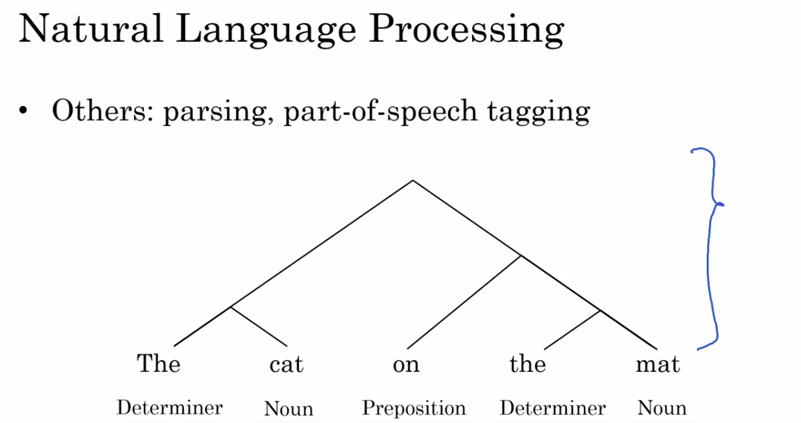</a>
					

* __Speech__
	* Modern AI, specifically deep learning has also completely transformed how software processes audio data such as speech
	* How is speech represented in a computer?
					

					  
					

		* This is an audio waveform
		* The x-axis here is time, and the vertical axis is what the microphone is recording
			* What the microphone is recording is little variations, very rapid variations in air pressure which your year and your brain then interpret as sound
			* This plot shows as a function of time, the horizontal axis, how the air pressure is changing very rapidly in response to someone say the word "machine learning"
	* The problem of __speech recognition__, also known as speech-to- text, is the problem of taking as inputs a plot like this, and figuring out what were the words that someone said
		* A lot of speech recognition's recent progress has been due to deep learning
	* One particular type of speech recognition is trigger __word detection__ or __wakeword detection__
		* an AI system detect a trigger word or the wakeword such as Alexa, or Hey Google, or Hey device
	* __Speaker ID__ is a specialized speech problem where the task is to listen to someone speak and figure out the identity of the speaker
		* Just as face recognition helps verify your identity by taking a picture, speaker ID can also help verify your identity by listening to you speak
	* Finally, __speech synthesis__, also called __text-to-speech__ or __TTS__ is also getting a lot of traction
		* Text-to-speech is a problem of inputting a sentence written in text and turning that into an audio file
		* Interestingly, whereas, text-to-speech is often abbreviated TTS, I don't often see speech-to-text abbreviated STT
		* One quick example. Let's take the sentence, "The quick brown fox jumps over the lazy dog."
			* This is a fun sentence that you often see NLP people use because this sentence contains every single letter from A to Z
			* So, that's ABC all the way up to X, Y, and Z
				* You can check all 26 letters appear in this sentence
		* Modern TTS systems are increasingly sounding more and more natural and human-like
					

					  <a href="javascript:void(0)" rel="noopener">
						 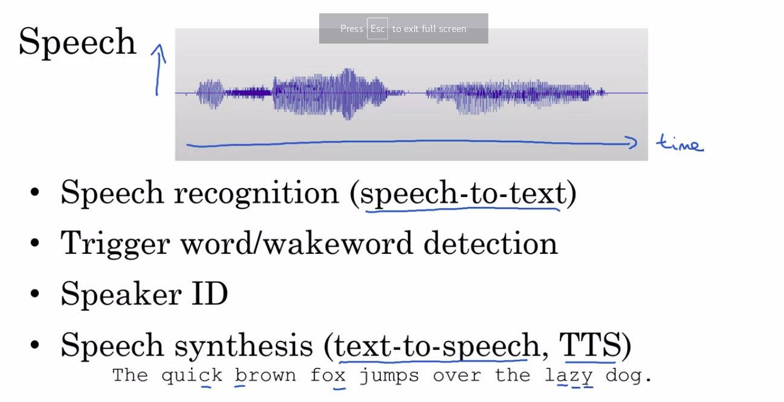</a>
					

* __Robotics__
	* In robotics, the term perception means figuring out what's in the world around you based on the senses you have, be it cameras, or radar, or lidar
	* Shown on the right ( in image below ) is the 3D laser scan or the lidar scan of a self-driving car as well as the vehicles that this self-driving car the middle has detected in the vicinity of your car
	* Motion planning refers to finding a path for your robot to follow
		* So, if your car wants to make a left turn, the motion planner might plan a path as well as a speed for the car to make a left turn that way
	* Finally, control refers to sending commands to the motors such as your steering wheel motor, as well as your gas pedal, and brake motors in order to make the car smoothly follow the path that you want
	* But a lot of the work AI on perception, motion planning, and control has focused on the software rather than the hardware of robotics
					

					  <a href="javascript:void(0)" rel="noopener">
						 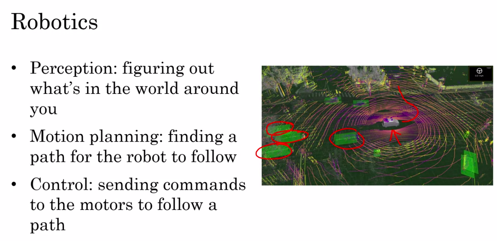</a>
					

* __General Machine Learning__
	* Unstructured data such as images, audio, and text
	* Machine learning is applied at least as much to structured data, and that means these tables of data
	* But because unstructured data such as images is so easy for humans to understand, there's something very universal, very easy for any person to understand and empathize with when we talk about an AI system that recognizes a cat
	* So, the popular press tends to cover AI progress on unstructured data much more than it does AI on structured data
	* Structured data also tends to be more specific to a single company
	* So, it's harder for people to write about or understand, but AI on structured data, or machine learning on structured data is creating tremendous economic value today as well as AI on unstructured data
					

					  <a href="javascript:void(0)" rel="noopener">
						 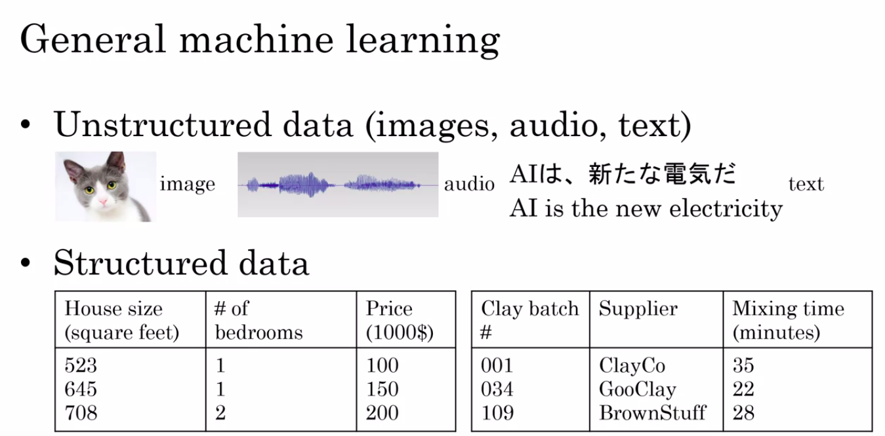</a>
					

### Survey of major AI techniques (optional)

* Unsupervised Learning
	* Clustering
		* The best known example of unsupervised learning is clustering
		* Example
			* Let's say you run a grocery store that specializes in selling potato chips
				* And you collect data on different customers, and keep track of how many different packets of potato chips a single customer buys, as well as what's the average price per package that person paid for their potato chips
			* So you sell some low end, cheaper potato chips, as well as some high end, more expensive packets of potato chips
				* And different people may buy different numbers of potato chip packets, in a typical trip to your grocery store
			* Given data like this, a clustering algorithm will say that it looks like you have two clusters in your data
				1. Cluster 1
					* Some of your customers tend to buy relatively inexpensive potato chips, but buy a lot of packets
					* If your grocery store is near a college campus, for example, you may find a lot of college students that are buying cheaper potato chips packets, but they sure buy a lot of them
				1. Cluster 2
					* there's a second cluster in this data of a different group of shoppers that buy fewer packets of potato chips, but buy more expensive packets
			* A clustering algorithm looks at data like this (as shown in image below), and automatically groups the data into two clusters or more clusters, and is commonly used for market segmentation
				* And will help you discover things like that if you have a college student audience that buys a certain type of potato chips, and a working professional audience that buys fewer potato chips but is willing to pay more
				* And this can help you market differently to these market segments
					

					  <a href="javascript:void(0)" rel="noopener">
						 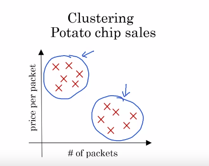</a>
					

		* The reason this is called unsupervised learning is the following
			* Whereas supervised learning algorithms run an A to B mapping, and you have to tell the algorithm what is the output B that you want
			* an unsupervised learning algorithm doesn't tell the AI system exactly what it wants
				* Instead it gives the AI system a bunch of data such as this customer data, and it tells the AI to find something interesting in the data, find something meaningful in the data
				* And in this case, a clustering algorithm doesn't know in advance that there's a college student demographic and a working professional demographic
				* Instead, it just tries to find what are the different market segments without being told in advance what they are
	* So unsupervised learning algorithms, given data without any specific design output labels, without the target label B, can automatically find something interesting about the data
	* It's hard to visualize exactly what an AI algorithm is thinking sometimes, but this picture on the right is a visualization of the concept of the cat that the system had learned
						

						  <a href="javascript:void(0)" rel="noopener">
							 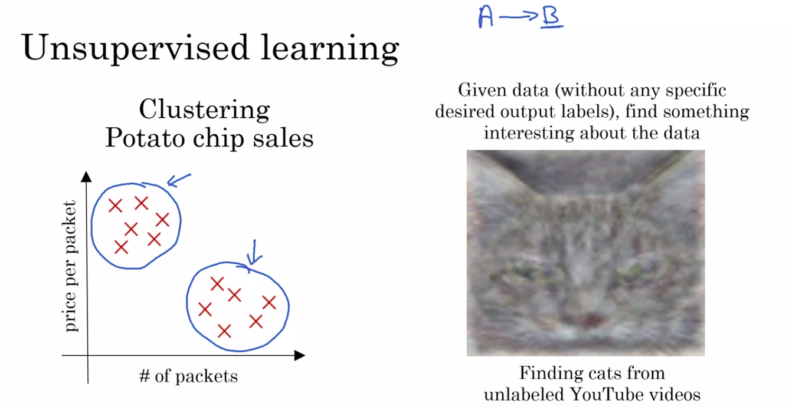</a>
						

	* Even though supervised learning is an incredibly valuable and powerful technique, one of the criticisms of supervised learning is that it just needs so much labeled data
		* For example
			* if you're trying to use supervise learning to get the AI system to recognized coffee mugs, then you may give it 1000 pictures of coffee mug, or 10,000 pictures of mug coffee mug
			* And that's just a lot of picture of coffee mugs coffee mug we will be giving our AI systems
	* So, AI systems today require much more labeled data to learn than when a human child or than would most animals
		* Which is why AI researchers hold a lot of hope out for unsupervised learning as way, maybe in the future, for AI to learn much more effectively in a more human like way, and more biological like way for much less labeled data
	* Unsupervised learning is valuable today
		* There are some specific applications and natural language processing, for example, where unsupervised learning helps the quality of web search quite a bit
		* But the value today of unsupervised learning is so a lot smaller than the value created through supervised learning
* __Tranfer Learning__
	* Example
		* Let's say you bought a self driving car, and you've trained your AI system to detect cars
		* But you didn't deploy your vehicle to a new city and somehow this new city has a lot of golf carts travelling round
			* so you need to also build a golf cart detection system
		* You may have your car detection system with a lot of images, say 100,000 images, but in this new city where you just start operating, you may have a much smaller number of images of golf carts
	* Transfer learning is the technology that lets you from a task A, such as car detection, and use the knowledge to help you on a different task B, such as golf cart detection
	* Where transfer learning really shine is if having learn from a very large dataset of car detection, task A, you can now do pretty well on golf cart detection, even though you have a much smaller golf cart dataset
		* Because some of the knowledge it has learned from the first task, of what the vehicles look like, what the wheels look like, how the vehicles move
		* Maybe that will be useful also for golf cart detection
	* Transfer learning doesn't get a lot of press, but it is one of the very valuable techniques in AI today
		* for example, many computer vision systems are built using transfer learning, and this makes a big difference to their performance
						

						  <a href="javascript:void(0)" rel="noopener">
							 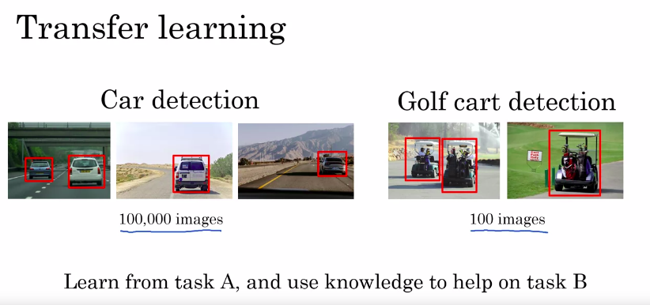</a>
						

* __Reinforcement Learning__
	* Example
		* This is a picture of the Stanford autonomous helicopter
						

						  <a href="javascript:void(0)" rel="noopener">
							 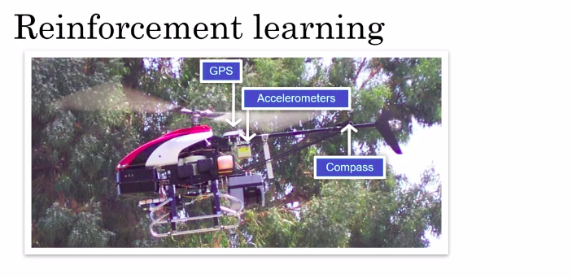</a>
						

			* So it's instrumented with GPS, accelerometers, and a compass, so it always knows where it is
			* And let's say you want to write a program to make it fly by itself
			* It's hard to used supervised learning input/output, A to B mappings, because it's very difficult to specify what is the optimal way
				* What is the best way to fly the helicopter when it is in a certain, given position
		* Reinforcement learning offers a different solution
		* So, we would have the helicopter flying around in a simulator so it could crash without hurting anyone
		* But we would let the AI fly the helicopter however once, and whenever it flew the helicopter well, we will go, good helicopter
			* And when if it crash, we go bad helicopter
		* And then there was the AI's job to learn how to fly the helicopter to get more of the good helicopter rewards, and fewer of the bad helicopter negative rewards
	* More formally, a reinforcement learning algorithm uses a reward signal, to tell the AI when it's doing well or poorly
		* This means that whenever it's doing well, you give it a large positive number to give it a large positive reward
		* And whenever it's doing really bad job, you send it a negative number to give it a negative reward
		* And it's the AI's job to the automatically learn to behave so as to maximize the rewards
		* And that the AI will learn to get more of the behaviors that results in large positive numbers, or in large positive rewards
						

						  <a href="javascript:void(0)" rel="noopener">
							 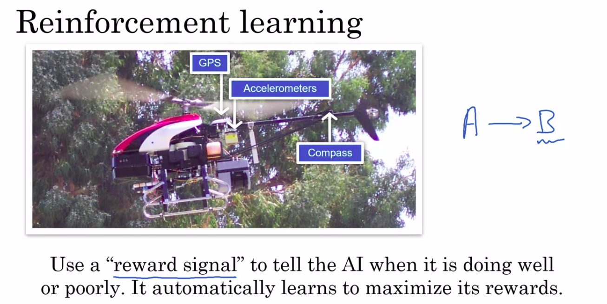</a>
						

	* In addition to robotic control, reinforcement learning has also had a lot of traction in playing games, games such as Othello or checkers or chess or Go
		* AlphaGo, which did a very good job of playing Go using reinforcement learning
		* And reinforcement learning has also been very effective at playing video games
		* One of the weaknesses of reinforcement learning algorithms is that they can require a huge amount of data
		* So, if you are playing a video game, a reinforcement learning algorithm can play, essentially, an infinite number of video games
			* Because it's just a computer playing a computer game, and get a huge amount of data to learn how to behave better
			* for playing games like checkers, or other games. It can play a lot of games against itself, and for free, get a huge amount of data to feed in its reinforcement learning algorithm
		* In the case of the autonomous helicopter, we had simulator for the helicopter, so it could fly in simulation for a long time to figure out what works and what doesn't work for flying a helicopter
	* Despite the huge amount of media attention on reinforcement learning, at least today it is creating significantly less economic value than supervised learning
		* But there may be breakthroughs in the future that could change that
						

						  <a href="javascript:void(0)" rel="noopener">
							 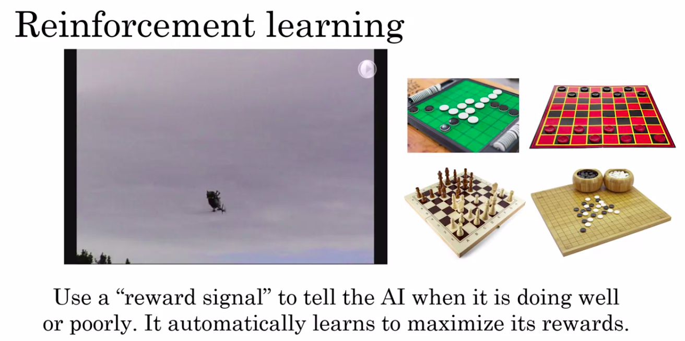</a>
						

* __GANs or Generative Adversarial Networks__
	* GANs, or generative adversarial networks, are another exciting new AI technique
	* They were created by Ian Goodfellow
	* GANs are very good at synthesizing new images from scratch
	* There's exciting work by different things right now on applying GANs to the entertainment industry
		* Everything ranging from computer graphics to computer games, to media, and to just making up new contents like this from scratch
						

						  
						

* __Knowledge Graph__
	* the knowledge graph is another important AI technique that is very underrated
	* If you do a search on Google of Leonardo da Vinci, you might find this set of results with this panel on the right of information about da Vinci
						

						  <a href="javascript:void(0)" rel="noopener">
							 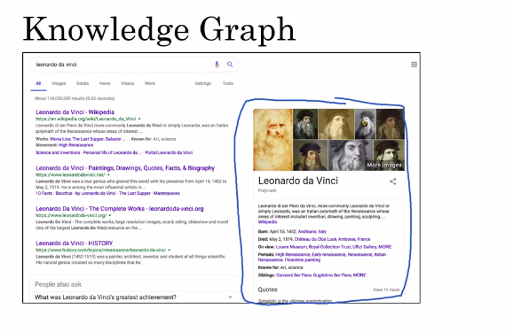</a>
						

	* If you do a search on Ada Lovelace, you'll also similarly find a panel of additional information on the right
		* This information is drawn from a Knowledge Graph, which basically means a database that lists people and key information about these people
		* Such as their birthday, when they pass away, their bio, and other properties of these individuals
	* Today different companies have built knowledge graphs of many different types of things not just people
	* But also they built these data bases of movies, of celebrities, of hotels, of airports, of scenic attractions, and on and on
	* For example
		* a Knowledge Graph with hotel information may have a big database of hotels as well as key information about these hotels
		* So that if you look them up on the map you can find the right information relatively quickly
	* The term Knowledge Graph was initially popularized by __Google__, but this concept has spread to many other companies
	* Interestingly, even though Knowledge Graphs are creating a lot of economic value for multiple large companies at this point, this is one subject that is relatively little-studied in academia
		* And so, the number of research papers you see on Knowledge Graphs, seems to be disproportionately small, relative to the actual economic impact today
		* But, depending on what industry vertical you work in, perhaps some of the techniques for building Knowledge Graphs, will also be useful for building a big database of information about something relevant to your company
						

						  <a href="javascript:void(0)" rel="noopener">
							 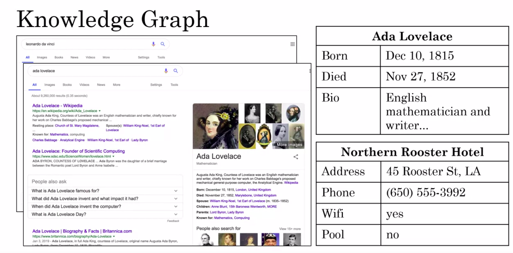</a>
						

