AI For Everyone
===============

by deeplearning.ai

# Module 4

#
## Title: AI and Society

## AI and Society

### Week 4 Introduction

* AI is a superpower that enables a small team to affect a huge number of people's lives
* So, whether you're builder or user of AI or whether you're just somebody cares about AI's impact on society, is important that you learn about these trends, so that you can make sure the work you do leave society better off
* AI is changing the world, but there's also been a lot of unnecessary hype about it
	* For citizens and business leaders and government leaders to navigate the rise of AI, it's importance is that we all have a realistic view of AI
* AI has other limitations as well
	* For example, AI can be biased and discriminate unfairly against minorities or against other groups
	* AI technology is also susceptible to adversarial attacks, meaning for example, we love our spam filters, it helps the email system keep on functioning
	* But there are spammers that are trying to attack spam filters
	* Even as we develop new AI technologies, some of the new technologies may be susceptible to new types of attacks as well if people are deliberately trying to fool the AI
* Developed economies such as the US and China, are already using AI extensively, but they'll also have a big impact on developing economies and on the global jobs landscape
* Many of these issues are implicated in AI and ethics. To make sure that the work we do in AI is ethical
	* This is a topic that is complex and there aren't simple answers. In fact, I think the topic of AI and ethics deserves it's own four week or much longer course
				

				  <a href="javascript:void(0)" rel="noopener">
					 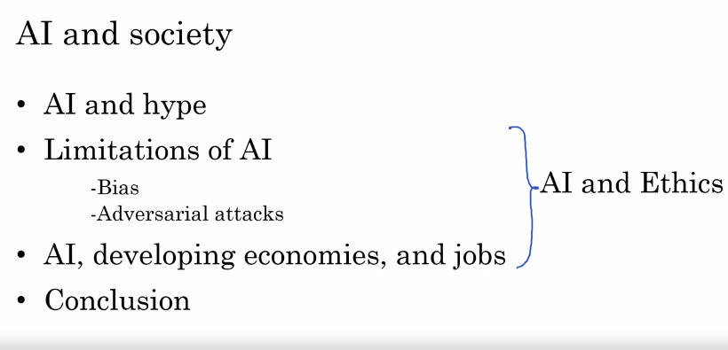</a>
				

### A realistic view of AI

* So, for all of us to make good decisions, it is important that we have a realistic view of AI and be neither too optimistic nor too pessimistic
* Goldilocks Rule for AI
	* It's important that we be neither too optimistic nor too pessimistic about what AI technology can or cannot do
		* For example, we should not be too optimistic about AI technologies and having an unrealistic view of AI technologies may make people think that sentience or super intelligence, artificial, general intelligence is coming soon, and we should invest a lot of resources into defending against AI evil killer robots
	* There's nothing wrong with doing a few studies to think about what the distant future could look like if AI becomes sentience some day
	* Doing basic research on that is really not a problem but we shouldn't over allocate resources either to defending against a danger that realistically will not come for long time
	* Unnecessary fears about sentience, super intelligence, artificial general intelligence is distracting people from the real issues and it's also causing unnecessary fears about AI in parts of society
	* On the flip side, we don't want to be too pessimistic about AI either
		* The extreme pessimist view of AI, is that AI cannot do everything
		* There are some things AI cannot do and so, another AI winter is coming
		* The term AI winter refers to a couple of episodes in history when AI had been over-hyped and when people figured out that AI couldn't do everything that they thought it would
			* It resulted in a loss of faith and a decrease in investment in AI
	* One difference between AI now and the earlier winters of a few decades ago, is that AI today is creating tremendous economic value
		* We also see a surprisingly clear path for it to continue to create even more value in multiple industries
		* So, the combination of these two things ensures that AI will continue to grow for the foreseeable future
	* What we realize now, is that AI can't do everything. In fact, there's a lot it cannot do but it will transform industries and society
					

					  <a href="javascript:void(0)" rel="noopener">
						 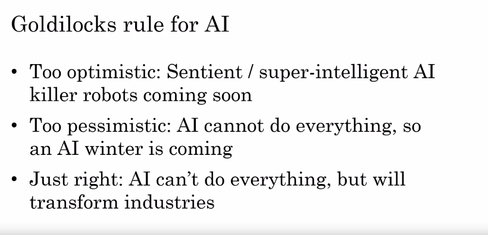</a>
					

* Limitations of AI
	1. Performance Limitation
		* There are many limitations of AI. You have already seen earlier some of the performance limitations
			* For example, given a small amount of data, a pure AI probably cannot fully automate a call center and give very flexible responses to whatever customers are emailing you with
	1. Explainability is Hard
		* many high-performing AI systems are black boxes
		* Meaning that it works very well but the AI doesn't know how to explain why it does what it does
		* Example
			* Let's say you have an AI system look at this X-ray image to diagnose if anything is wrong with the patient
			* In this example, which is a raw example, the AI system says that it thinks a patient has right-sided pneumothorax
				* Which means that their right lung is collapsed
			* But how do we know if the AI is right and how do you know if you should trust the AI system's diagnosis or not
			* There's been a lot of work on making AI systems explain themselves
			* In this example, the heat map is the AI telling us what parts of the image it is looking at in order to make this diagnosis
				* Because it is clearly basing its diagnosis on the right lung and in fact on some key features of the right lung
				* Seeing this image may give us more confidence that the AI is making a reasonable diagnosis
					

					  <a href="javascript:void(0)" rel="noopener">
						 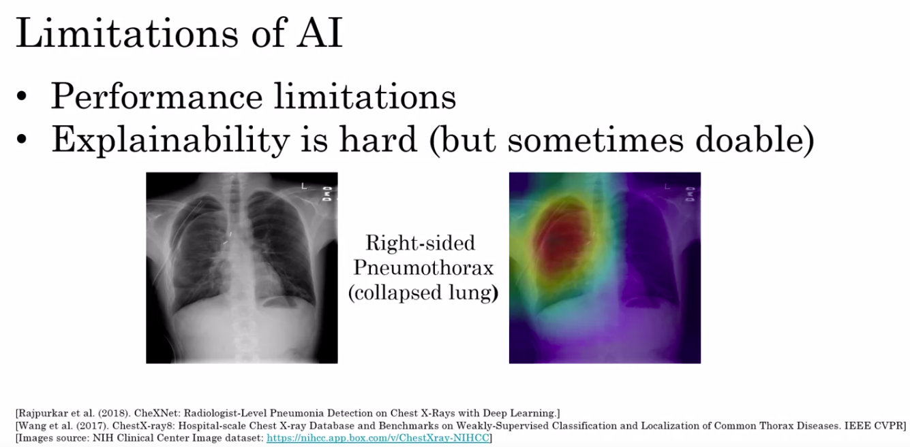</a>
					

		* Now, to be fair, humans are also not very good at explaining how we make decisions ourselves
			* For example
				* you've already seen this coffee mug in the last weeks videos but how do you know it's a coffee mug? How does a human look at this and say, that's a coffee mug? You know there are some things you can point to like, there's a room for liquid and it has a handle
					* But we humans are not very good at explaining, how we can look at this and decide what it is
					* But because AI is a relatively new thing, the lack of explainability is sometimes a barrier to its acceptance
					* Also, sometimes if an AI system isn't working then its ability to explain itself would also help us figure out how to go in and make the AI system work better
	1. Biased AI through biased data
		* As a society, we do not want to discriminate against individuals based on their gender, based on their ethnicity and we want people to be treated fairly
			* But when AI systems are fed data that doesn't reflect these values, then an AI can become bias or can learn to discriminate against certain people
		* The AI community is working hard and is making good progress on these issues but we're far from done and there's still a lot of work to do
	1. Adversarial Attacks on AI
		* Finally, many AI systems are making economically important decisions and some AI systems are open to adversarial attacks, if someone else is deliberately out to fool your AI system
		* So, depending on your application, it may be important to make sure that you are not open to these types of attacks on your AI systems
					

					  <a href="javascript:void(0)" rel="noopener">
						 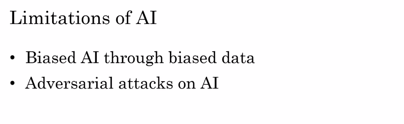</a>
					

* The issues of AI and discrimination or AI and bias, as well as the issue of adversarial attacks on AI, are important both to you as a potential builder and user of AI as well as to society

### Discrimination / Bias

* AI Learning Unhealthy Stereotypes
	* A group at Microsoft found this remarkable result that when AI learns from text file on the internet, it can learn unhealthy stereotypes
	* To the credit, they also proposed technical solutions for reducing the amount of bias in this type of AI system
	* Here's what they found
		* By having an AI read text on the Internet, it can learn about words, and you can ask it to reason about analogies
		* So, you can quiz the AI system now that you've read all this text on the Internet, in the analogy, man is to woman as father is to what?
			* So, the AI will output the word mother, which reflects the way these words are typically used on the Internet
		* If you ask it men is to women, as king is to what? Then the same AI system will say, as King is to Queen, which again seems reasonable relative to the way these words are used on the Internet
		* The researchers also found the following result, which is that if you ask it, man is to computer programmer as women is to what? That same AI system would output the answer, woman is to homemaker
			* this answer is really unfortunate
			* Less bias answer would be of words to say, woman is to computer programmer
			* If we want our AI system to understand that men and women can equally be computer programmers, just as men and women can equally be homemakers, then we would like it to output man is to computer programmer, as woman is to computer programmer, and also man is to homemaker as woman is to homemaker
	* How does an AI system learn to become bias like this from data?
		* The way an AI system stores words is using a set of numbers
		* So, let's say the word man is stored, or we sometimes say represented as the two numbers 1,1
		* The way an AI system comes up with these numbers is through statistics of how the word man is used on the Internet
		* But these numbers represent the typical usage of these words
		* Let me take this number and plot it on a chart. So, the word man, I'm going to plot at the position 1,1 on the figure on the right
		* By looking at the statistics of how the words or how the phrase computer programmer is used on the Internet, the AI will have a different pair of numbers, say 3,2, to store or to represent the phrase computer programmer
		* Similarly, by looking at how the word woman is used, it'll come up with a different pair of numbers, say 2,3, to store or to represent the word woman
		* When you ask the AI system to compute the analogy above, man is to computer programmer, as women is to what? Then what the AI system will do, is construct a parallelogram that looks like this ( as shown in image below )
			* It will ask, what is the word associated with the position 4,4?
				* Because it will think that is the answer to this analogy
			* One way to think about this mathematically is that the AI thinks the relationship of man to computer programmer is that you start from the word man, go two steps to the right, and one step up. So, to find the same answer for women is to what,? You would also go two steps to the right, and one step up
		* Unfortunately, when these numbers are derived from texts on the Internet, and the AI system finds that the way the word homemaker is used on the internet causes it to be placed to the position 4,4, which is why the AI system comes up with this bias analogy
					

					  <a href="javascript:void(0)" rel="noopener">
						 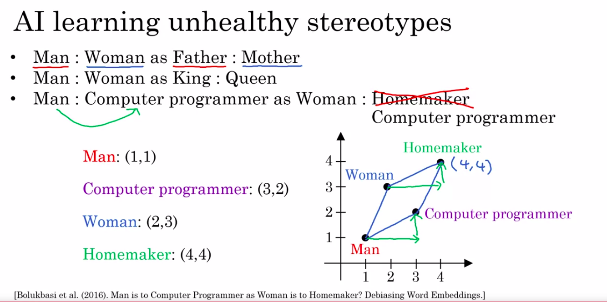</a>
					

* Why bias matters?
	* AI systems are already making important decisions today, and will continue to do so in the future as well
		* So, bias matters
	* For example
		1. there's a company that was using AI for hiring, and found that their hiring too discriminated against women
			* This is clearly unfair, and so this company shut down their tool
		1. Second, there're also some facial recognition systems that seem to work more accurately for light-skinned and dark-skinned individuals
			* If an AI system is trained primarily on data of lighter skin individuals, then it will be more accurate for that category of individuals to the extent that these systems are used in, for example, criminal investigations, this can create a very biased and unfair effect for dark-skinned individuals
	* So, many face recognition teams today are working hard to ensure that the systems do not exhibit this type of bias
	* There have also been AI or statistical loan approval systems that wound up discriminating against some minority ethnic groups, and quoted them a higher interest rate
	* Banks have also been working to make sure to diminish or eliminate this type of bias in their approval systems
	* Finally, I think it's important that AI systems do not contribute to the toxic effect of reinforcing unhealthy stereotypes
		* For example
			* if an-eight-year old girl goes to an image search engine and searches for Chief Executive Officer, if they see only pictures of men or if they see no one that looks like themselves either by gender or ethnicity, we don't want them to be discouraged from pursuing a career that might lead her to someday be a Chief Executive Officer of a large company
					

					  <a href="javascript:void(0)" rel="noopener">
						 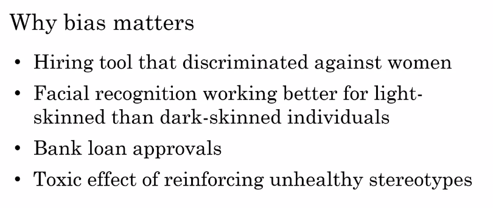</a>
					

				* Because of these issues, the AI community has put a lot of effort into combating bias
* Combating bias
	* For example, we're starting to have better and better technical solutions for reducing bias in AI systems
	* In the example of the AI outputting buyers analogies
		* Simplifying the description a little bit, researchers have found that when an AI system learns a lot of different numbers with which to store words, there are few numbers that correspond to the bias. If you zero out those numbers, just set them to zero, then the bias diminishes significantly
	* A second solution is to try to use less bias and or more inclusive data
		* For example
			* if you are building a face-recognition system, and make sure to include data from multiple ethnicities, and all genders, then your system will be less biased and more inclusive
	* Second, many AI teams are subjecting their systems to better transparency and or auditing processes, so that we can constantly check what types of bias, if any, these AI systems are exhibiting, so that we can at least recognize the problem if it exists, and then take steps to address it
		* For example
			* many face recognition teams are systematically checking how accurate their system is on different subsets of the population to check whether, it is more or less accurate on dark-skinned versus light-skinned individuals
					

					  
					

		* Having transparent systems as well as systematic auditing processes increases the odds that will at least quickly spot a problem, in case there is one, so that we can fix it
	* Finally, I think having a diverse workforce will also help reduce bias
		* If you have a diverse workforce, then the individuals in your workforce are more likely to be able to spot different problems, and maybe they'll help make your data more diverse and more inclusive in the first place
		* By having more unique points of view as you're building AI systems, I think there's a hope all of us create less bias applications
					

					  <a href="javascript:void(0)" rel="noopener">
						 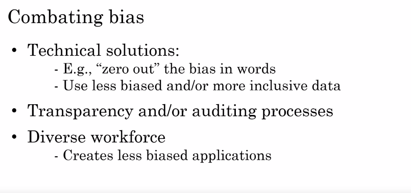</a>
					

* AI systems are making really important decisions today, and so the bias or potential for bias is something we must pay attention to and work to diminish
* One thing that makes me optimistic about this is that we actually have better ideas today for reducing bias in AI than reducing bias in humans

### Adversarial attacks on AI

* Even though modern AI is incredibly powerful, one of the limitations of modern AI technologies especially deep learning is that sometimes it can be fooled
* In particular, modern AI systems are sometimes susceptible to adversarial attacks, if someone else sets out deliberately to fool your AI system
* Let's say you give an AI system, this picture of a bird and ask it to classify it
	* The AI system outputs that this is a hummingbird
	* But lets we make a minor perturbation to this image
		* By minor perturbation, I mean to change the pixel values just a little bit and almost imperceptible change to most people
	* The same AI system then says this is instead a hammer
	* Now, to person you might say, "How is this even possible, the picture on the right looks almost identical to the picture on the left?"
		* In fact, the changes are almost imperceptible to the human eye
	* So, it is susceptible to if an adversary makes changes to a picture that could be imperceptible to you and me but their results in fooling the AI into thinking this picture is something totally different
		* We call this an adversarial attack on an AI system
	* an __adversarial attack__ on an AI system is an attempt to make it do something other than what it was intended to do, such as trying to fool it into outputting incorrect classifications
	* Here's another example. Here's a picture of a hare with just a minor perturbation or a small change to the pixel values, AI instead says this is a desk
					

					  <a href="javascript:void(0)" rel="noopener">
						 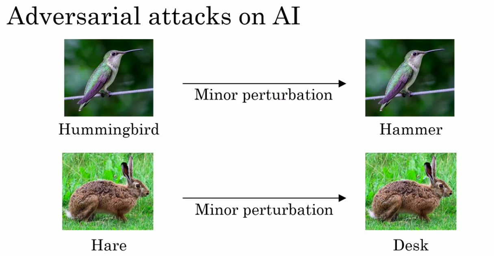</a>
					

	* The fact that computers see pictures differently than humans do, gives it advantages and disadvantages
		* For example, computer systems are much better than you and me at reading barcodes and QR codes
			* But the way that deep learning systems work also opens us up to these particular forms of attack which no human would be fooled by
	* Today, AI is being used to filter out spam, to try to filter out hate speech, and attacks like these will diminish the effectiveness of such filters
	* Now, the attacks on this slide require the ability to modify an image directly
		* For example, a spammer might directly modify an image before they tried to upload it to a website or send it in an email
* Physical Attacks
	* There are some attacks that work by changing the physical world as well
	* For example
		1. a group at Carnegie Mellon University was able to design a funky pair of glasses
			* So, that when does man wears this pair of glasses, he can fool an AI system into thinking that he is actress Milla Jovovich
			* it's remarkable that just wearing a pair of glasses like this can fool an AI system into thinking that this man is a well-known actress
					

					  
					

		1. A different group of researchers from UC Berkeley, University of Michigan and other universities, showed that if you affects stickers like these onto a stop sign, you can fool an AI system into not seeing the stop sign at all
					

					  
					

			* It things there's something else there other than a stop sign
			* One interesting thing about this example is that it looks like the stop sign just had some graffiti applied on top of it
			* Most humans will still see this as a stop sign quite easily
			* But if you have a computer vision system built into a self-driving car for example, it would be really unfortunate if the car doesn't see the stop sign anymore, because of these stickers applied on top of it
		1. this one from a group of researchers at Google, is if you show a AI system this ( as shown in image ) picture, it will say this is a banana
			* But what the researchers did was design a sticker, so that if you place it into the scene, it misclassifies this banana
			* Shown on the left is the classifier input and shown on the right is the classifier output, where it thinks is very likely a banana and maybe there's a small chance is a slug
					

					  <a href="javascript:void(0)" rel="noopener">
						 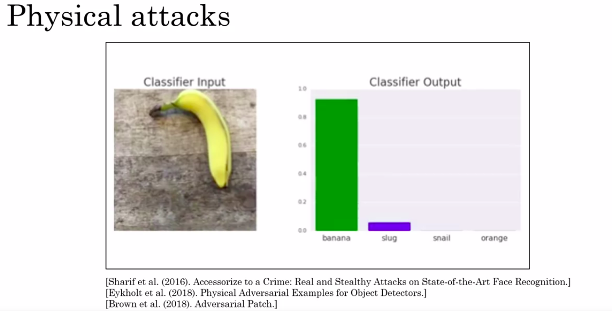</a>
					

			* Let's see what happens when you put a sticker or put a small patch into the scene
				* When the sticker is placed in the scene, the AI system now is almost certain that this picture is a picture of a toaster
				* One interesting aspect of this work is that the authors of this paper cited at the bottom of this slide, actually published in their paper a picture of their sticker
					* So, that anyone in the world could hypothetically download their paper, print out the sticker, and stick it somewhere if they want to fool an AI system into thinking there's a toaster where there isn't
						

						  <a href="javascript:void(0)" rel="noopener">
							 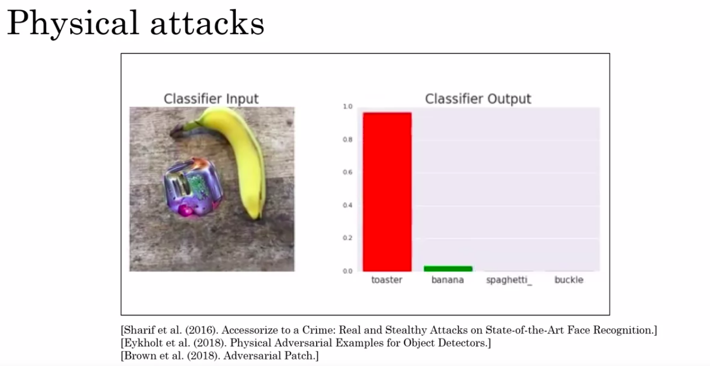</a>
						

* Adversarial Defenses
	* The defenses tend to be very technical, but there are ways of modifying neural networks and other AI systems to make them somewhat harder to attack
	* One downside is that these defenses do incur some cost
		* For example, the AI system may run a little bit slower
	* But this is an area of ongoing research and we're far from heavy adversarial defenses that seem good enough for all of the important applications that we want to apply AI to
	* For many AI systems, there may be no incentive for anyone to try to attack it
		* For example, if you're running a automatic visual inspection system to check if coffee mugs have scratches in your factory
			* Maybe not that many people who have any incentive to try to fool your system into thinking a scratch coffee mug doesn't have a scratch on it
	* But there are going to be AI applications where there will be attacks as well
		* For those applications, I think that similar to spam versus anti-spam, where spammers are trying to get the spam email through and spam filters are trying to stop them
			* I think there will be applications where we will be in an arms race, as a AI community is building up defenses and there is a community of attackers trying to fool our defenses
						

						  <a href="javascript:void(0)" rel="noopener">
							 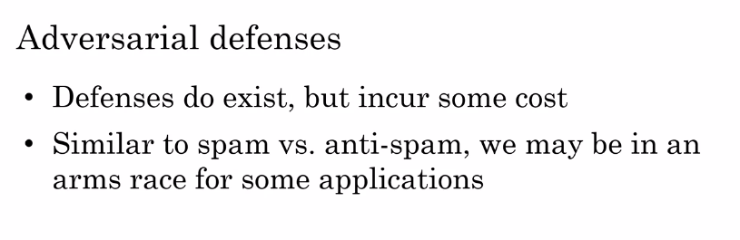</a>
						

### Adverse uses of AI

* AI is incredibly powerful and the vast majority of users of AI are making people, companies, countries, society better off
* Adverse Uses
	1. DeepFakes
		* AI technology has been used to create deepfakes and that means to synthesize video of people doing things that they never actually did
		* The website BuzzFeed, created a video of former US President Barack Obama saying things that he never did
			* BuzzFeed was transparent about it and when they publish the video, it was really obvious because he told everyone that this is a fake video
			* But if this type of technology is used to target an individual and make others think they said or did things they never actually did, then these individuals could be harmed and left to defend themselves against fake video evidence of something they never actually did
		* Similar to the war of spam versus anti-spam, there is AI technology today for detecting if a video is a deepfake
	1. Undermine Democracy and Privacy
		* There's also a risk of AI technology being used to undermine democracy and privacy
		* For example, many governments around the world are trying to improve their citizens' lives, and have a lot of respect for the government leaders that are uplifting their citizens
			* But there are also some oppressive regimes that are not doing the right things by their citizens, that may seek to use this type of technology to carry out oppressive surveillance of their citizens
		* While governments have illegitimate need to improve public safety and reduce crime, there are also ways of using AI that feel more oppressive than uplifting of its own citizens
	1. Generating Fake Comments
		* Using AI technology is now possible to generate fake comments
		* Either on the commercial side, fake comments of products, or in political discourse, fake comments about political matters in the public discourse, and to generate fake comments much more efficiently than if you only had humans writing them
		* So, detecting such fake comments and weeding them out, is an important technology for maintaining trust in comments that we might read online as well
	1. spam vs anti-spam and fraud vs anti-fraud
		* I think that for all of these issues, there may be a competition on both sides for quite some time to come

### AI and developing economies

* Every time there is a major technological disruption such as of AI, it gives us a chance to remake the world
* AI is a very advanced technology, yes affecting both developed economies and developing economies
* Developing Economies
	* There's been a fairly predictable roadmap, almost a ladder, that many developing economies have successfully executed in order to help the citizens gain skills and climb to higher levels of wealth
	* All the nations started off with low-end agricultural products, exporting crops, and then moved to low-end textile manufacturing, such as clothing manufacturing
		* Then as a population starts to gain a bit more wealth, become a bit more healthy, move on to low-end components manufacturing, such as making less expensive plastic parts
	* So, then moving on to low-end electronics manufacturing, to high-end electronics manufacturing, maybe to automotive manufacturing, and so on
	* There's been this step-by-step progression by which developing economies can hope their citizens gain skill and become developed economies
	* One of the problems that AI could cause is that, a lot of the lower rungs on the ladder are particularly susceptible to automation through AI
		* For example
			* as factories become more automated, or as agriculture becomes more automated, there may be less needed and therefore lesser opportunities for large members of a population of some of these developing economies to get onto the lower rungs of the economic ladder from which they would then climb up
	* So, if we're knocking out some of the lower rungs of the ladder through AI, through AI providing automation on steroids
		* it is incumbent on us to see if AI can also create a trampoline to hope some developing economies jump onto the trampoline and bounce maybe even more quickly to the highest rungs of this ladder
	* With the rise of earlier waves of technology, many economies have shown that they can leapfrog developed economies and jump straight to a more advanced technology
		* For example, here in the United States most of us had landlines
			* Phones that were connected via wire to the wall. Because so many of us had landline phones, that actually took a while to transition to wireless mobile phones
			* In contrast, many developing economies including India and China but many others as well, didn't bother to build nearly as many land lines, but skip straight to mobile phones
				* So, this was a leapfrog where developing economies jumped straight over the earlier generation of technology and didn't bother to lay so many physical cables at every person's house and instead jumped straight to mobile phones
	* We're seeing a similar thing with mobile payments where many developed economies have a mature credit card system and that actually is slowing down their adoption of mobile or cell phone payments compared to some developing economies which do not already have entrenched incumbents in the credit card industry
	* rapid adoption of online education in developing economies
		* In countries that have not yet built all the many many physical schools and universities that they need, many educational leaders and governments are seeking ways to more quickly embrace online education compared to some of the developed economies that have this built-up physical infrastructure for in-person education
	* While developed economies are also rapidly embracing all of these technologies, one of the advantages of developing economies is that without an entrenched incumbents system, perhaps there are areas that they could build even faster
						

						  <a href="javascript:void(0)" rel="noopener">
							 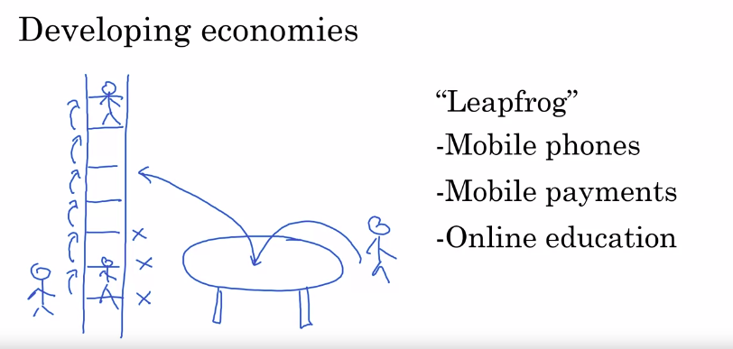</a>
						

* How developing economies can build AI
	* The US and China are leading, and the UK and Canada and a few other countries also have vibrant AI communities
		* But because AI is still so immature today, I think all AI communities are still immature
	* This means that even though AI is creating tremendous economic value, most of the value to be created is still off in the future
	* This gives every nation an opportunity to be a large part of creating this value that hasn't been created yet, and even capturing a large piece of it
	* Every nation can figure out how to effectively use AI to continue to hope his citizens
	* Advice to developing economies is to focus on the AI to strengthen a country's vertical industries
		* For example, I think most countries today should not try to build their own web search engine
			* There are already great web search engines and that was last decades competition
		* Instead, if a country has a very strong vertical industry in say coffee bean manufacturing, then that country is actually uniquely qualified to do work in AI for coffee manufacturing and building AI for coffee manufacturing will even further strengthen what that country is already good at
		* So, rather than needing for every country to compete with the US and China on AI in general, I would advice most countries to use AI to strengthen what that country is good at and what that country wants to do in the future
	* Finally, public-private partnerships, meaning governments and corporations working together, can really help accelerate a vertical industry's AI developments
		* In highly regulated sectors, ranging from healthcare to transportation like self-driving cars to finance, there are certain outcomes that we want and certain outcomes that we don't want
		* Governments that are thoughtful about crafting derived regulations to protect citizens while at the same time enabling the adoption of AI solutions to these industries, will see faster local economic growth as well as faster technology development within their country
	* Finally, developing economies should invest in education because AI is still so immature
		* There's still plenty of room for every nation to learn more about AI, maybe even build up its own AI workforce and participate in a significant way in this AI powered world that we're building
						

						  <a href="javascript:void(0)" rel="noopener">
							 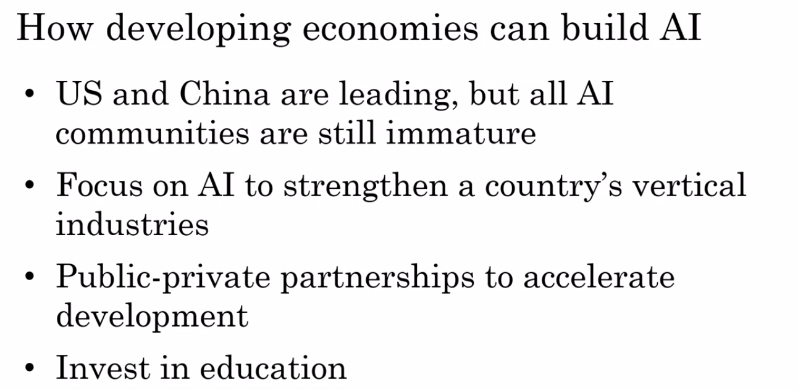</a>
						

* In moments of technological disruption, leadership matters
* Here in the United States, we once trusted our governments to put a man on the moon and it worked
* With the rise of AI, it creates a space, and in some countries a need for leadership, whether in the government levels, or in companies, or in education to help a country enter the AI era and embrace and adopt AI to keep on lifting up its citizens, and perhaps even keep on lifting up other people worldwide

### AI and jobs

* AI is automation on steroids.
* Before the rise of modern AI, automation had already had a huge impact on a lot of jobs
* With the rise of AI, the set of things we can now automate is suddenly much bigger than before, and so this is also having an accelerating impact on jobs
* McKinsey Global Institute did a study in which they estimated that 400 to 800 million jobs will be displaced by AI automation by 2030
	* These are very large numbers
	* On the flip side though, the same report also estimates that the number of jobs created by AI may be even larger
						

						  <a href="javascript:void(0)" rel="noopener">
							 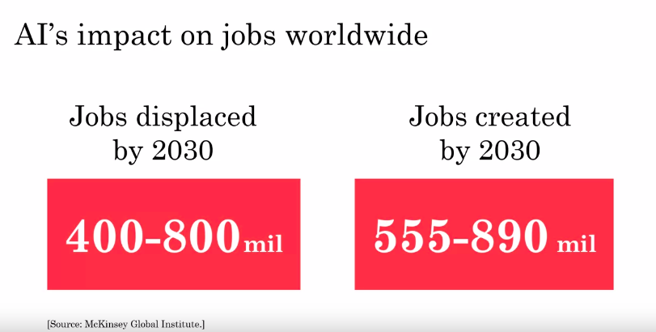</a>
						

* There have been many studies other than the McKinsey Global Institute's one
	* There is a range in these estimates of numbers of jobs displaced and numbers of jobs created
	* For example
		1. just focusing on the United States, the numbers on this slide are worldwide, but just focusing on the United States
			* PwC estimates about 16 million jobs displaced by 2030
			* Bank of England estimates 80 million jobs displaced by 2035
* how do we estimate how many jobs are likely to be displaced?
	* One typical way that these studies are carried out would be to take a job and think of the task that make up the job
	* For example
		* you might look at the task of the radiologist does or look at all the tasks that a taxi driver does
			* Then for each of the task, estimate how amenable it is to automation through AI and if a job comprises mainly task that are highly automatable, then the risks of the job being displaced will be higher
	* Most AI engineers find it more useful to think of AI being applied to task rather than to people's jobs
	* But this framework allows us to use AI's ability to automate tasks to estimate how many jobs are likely to be displaced
* So which are the jobs that are most likely or least likely to be displaced through AI and automation?
	* The OECD, a well-respected intergovernmental body, looked at the number of job types to estimate which of them are most and least likely to be automated
	* The future is hard to predict with certainty, but perhaps not surprisingly, many other jobs that comprise more routine repetitive work are more amenable to automation, whereas many of the tasks that are less repetitive, less routine or that involve more social interaction with people maybe less susceptible to automation
						

						  <a href="javascript:void(0)" rel="noopener">
							 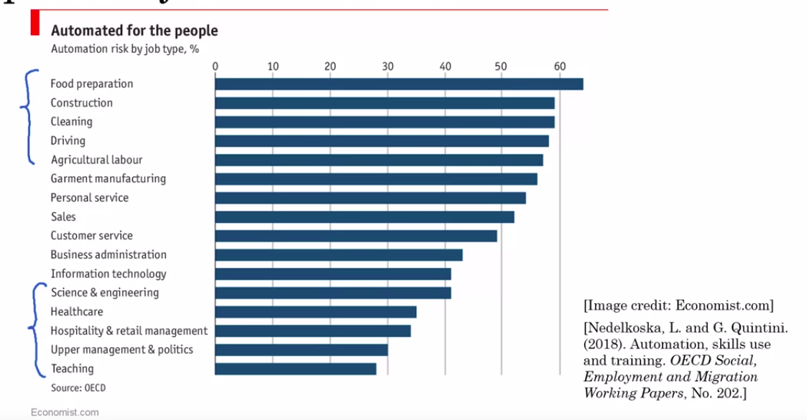</a>
						

* How do we hope citizens and nations navigate the coming impact of AI on jobs?
	1. First, conditional basic income
		* You may have heard of universal basic income in which a government would pay citizens with no strings attached
		* I think people do deserve a safety net
		* For individuals that are unemployed but are able to learn, I think a more effective version may be conditional basic income in which we do provide the safety net but incentivize them to keep on learning and keep on investing in their own development
		* By providing a structure to help people that can learn do so, this will increase the odds that those individuals can re-enter the workforce, contribute to themselves, their families and to society, as well as to the tech space that is paying for all this
	1. Second, building a lifelong learning society
		* By virtue of your taking this course right now, you may already be part of this lifelong learning society
		* The old model of education where you go to college for four years and then cost for the remaining 40, that just does not work anymore into these rapidly changing world
		* Through governments, companies and individuals realizing that all of us need to keep on learning, this increases the odds that everyone will be better position, even as jobs may go away
	1. Finally, there are political solutions being explored as well
		* Everything from incentivizing or helping with new job creation to legislation to make sure that people are treated fairly
		* I hope that society will figure out the right political solutions to navigate the coming impact of AI on jobs as well
						

						  <a href="javascript:void(0)" rel="noopener">
							 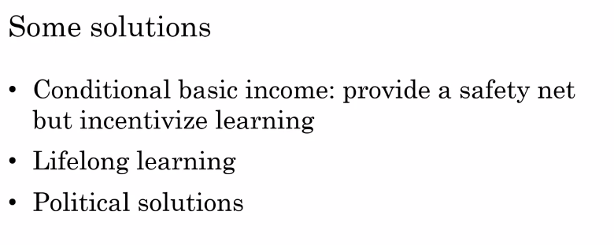</a>
						

### Conclusion

* AI is a super power, and understanding it allows you to do things that very few people on the planet can

